# redis快速入门

Redis的常见命令和客户端使用

## 1.初识Redis

Redis是一种键值型的NoSql数据库，这里有两个关键字：

- 键值型
- NoSql

其中**键值型**，是指Redis中存储的数据都是以key、value对的形式存储，而value的形式多种多样，可以是字符串、数值、甚至json：

而NoSql则是相对于传统关系型数据库而言，有很大差异的一种数据库。

**NoSql**可以翻译做Not Only Sql（不仅仅是SQL），或者是No Sql（非Sql的）数据库。是相对于传统关系型数据库而言，有很大差异的一种特殊的数据库，因此也称之为**非关系型数据库**。

* 结构化与非结构化

  * 传统关系型数据库是结构化数据，每一张表都有严格的约束信息：字段名、字段数据类型、字段约束等等信息，插入的数据必须遵守这些约束：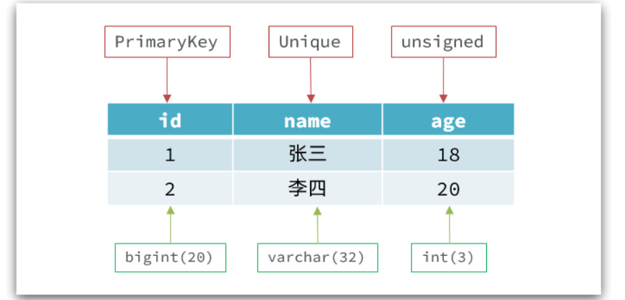

  * 而NoSql则对数据库格式没有严格约束，往往形式松散，自由。

    可以是键值型：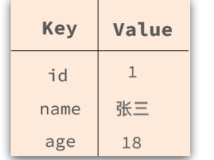

    也可以是文档型：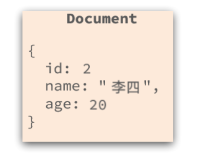

* 关联和非关联

  * 传统数据库的表与表之 间往往存在关联，例如外键：

* 查询方式

  * 传统关系型数据库会基于Sql语句做查询，语法有统一标准；

    而不同的非关系数据库查询语法差异极大，五花八门各种各样。

    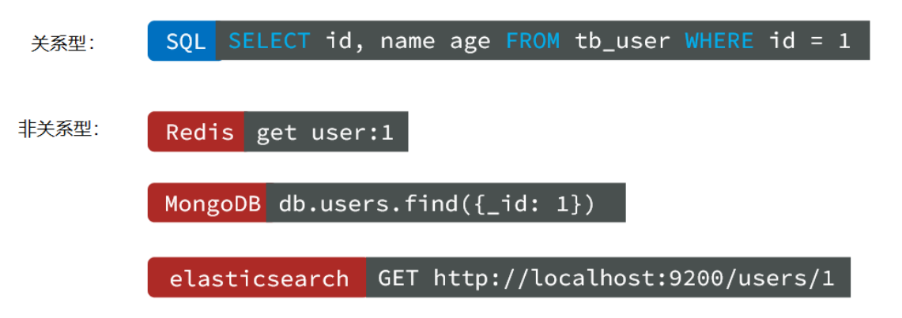

* 事务

  * 传统关系型数据库能满足事务ACID的原则。
  * 而非关系型数据库往往不支持事务，或者不能严格保证ACID的特性，只能实现基本的一致性。

* 存储方式

  * 关系型数据库基于磁盘进行存储，会有大量的磁盘IO，对性能有一定影响
  * 非关系型数据库，他们的操作更多的是依赖于内存来操作，内存的读写速度会非常快，性能自然会好一些

* 扩展性

  * 关系型数据库集群模式一般是主从，主从数据一致，起到数据备份的作用，称为垂直扩展。
  * 非关系型数据库可以将数据拆分，存储在不同机器上，可以保存海量数据，解决内存大小有限的问题。称为水平扩展。
  * 关系型数据库因为表之间存在关联关系，如果做水平扩展会给数据查询带来很多麻烦

* Redis的官方网站地址：https://redis.io/

## 2.redis下载

再contos7系统中

1. 安装redis依赖

Redis是基于C语言编写的，因此首先需要安装Redis所需要的gcc依赖：

```shell
yum install -y gcc tcl
```

此处报错

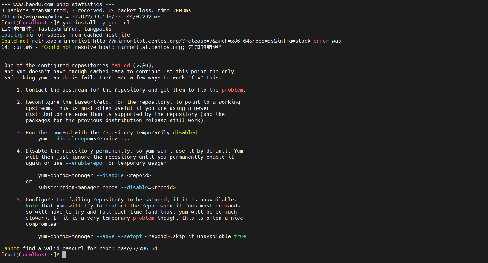

```shell

[root@localhost yum.repos.d]# yum install -y gcc tcl
已加载插件：fastestmirror, langpacks
Loading mirror speeds from cached hostfile
Could not retrieve mirrorlist http://mirrorlist.centos.org/?release=7&arch=x86_64&repo=os&infra=stock error was
14: curl#6 - "Could not resolve host: mirrorlist.centos.org; 未知的错误"


 One of the configured repositories failed (未知),
 and yum doesn't have enough cached data to continue. At this point the only
 safe thing yum can do is fail. There are a few ways to work "fix" this:

     1. Contact the upstream for the repository and get them to fix the problem.

     2. Reconfigure the baseurl/etc. for the repository, to point to a working
        upstream. This is most often useful if you are using a newer
        distribution release than is supported by the repository (and the
        packages for the previous distribution release still work).

     3. Run the command with the repository temporarily disabled
            yum --disablerepo=<repoid> ...

     4. Disable the repository permanently, so yum won't use it by default. Yum
        will then just ignore the repository until you permanently enable it
        again or use --enablerepo for temporary usage:

            yum-config-manager --disable <repoid>
        or
            subscription-manager repos --disable=<repoid>

     5. Configure the failing repository to be skipped, if it is unavailable.
        Note that yum will try to contact the repo. when it runs most commands,
        so will have to try and fail each time (and thus. yum will be be much
        slower). If it is a very temporary problem though, this is often a nice
        compromise:

            yum-config-manager --save --setopt=<repoid>.skip_if_unavailable=true

Cannot find a valid baseurl for repo: base/7/x86_64

```

不能够解析yum源，换yum源

1. 首先备份系统自带yum源配置文件/etc/yum.repos.d/CentOS-Base.repo 

```shell
mv/etc/yum.repos.d/CentOS-Base.repo /etc/yum.repos.d/CentOS-Base.repo.backup
```

2. 下载国内yum源配置文件到/etc/yum.repos.d/

   ```shell
   阿里源（推荐）：
   wget -O /etc/yum.repos.d/CentOS-Base.repo http://mirrors.aliyun.com/repo/Centos-7.repo
   网易源：
   wget -O /etc/yum.repos.d/CentOS-Base.repo http://mirrors.163.com/.help/CentOS7-Base-163.repo
   
   ```

   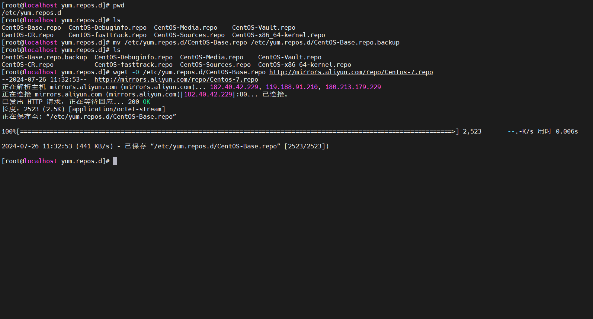

3. 清理yum缓存，并生成新的缓存

   ```shell
   yum clean all
   yum makecache
   ```

4. 更新yum源检查是否生效

   ```shell
   更新yum源检查是否生效
   yum update
   ```

   解决错误，安装成功


2. 下载安装包，并上传到虚拟机

   例如，我放到了/usr/local/src 目录：

   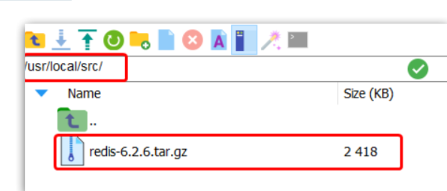

   解压：

   ```shell
   tar -xzf redis-6.2.6.tar.gz
   ```

3. 编译并安装

   进入redis目录

   ```shell
   cd redis-6.2.6
   ```

   运行编译命令：

   ```shell
   make && make install
   ```

   默认的安装路径是在 `/usr/local/bin`目录下：

   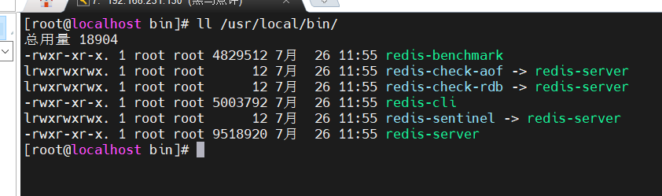

   该目录已经默认配置到环境变量，因此可以在任意目录下运行这些命令。其中：

   - redis-cli：是redis提供的命令行客户端
   - redis-server：是redis的服务端启动脚本
   - redis-sentinel：是redis的哨兵启动脚本

## 3.redis配置

安装完成后

```shell
redis-server
```

启动，不过不能关闭这个启动的页面，要不然就关闭了这个服务，不推荐使用


如果要让Redis以`后台`方式启动，则必须修改Redis配置文件，就在我们之前解压的redis安装包下（`/usr/local/src/redis-6.2.6`），名字叫redis.conf：

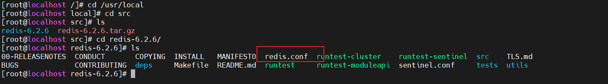

先备份

```shell
cp redis.conf redis.conf.bck
```

然后修改redis.conf文件中的一些配置：

```shell
# 允许访问的地址，默认是127.0.0.1，会导致只能在本地访问。修改为0.0.0.0则可以在任意IP访问，生产环境不要设置为0.0.0.0
bind 0.0.0.0
# 守护进程，修改为yes后即可后台运行
daemonize yes 
#关闭保护模式，默认开启。开始保护模式后，远程访问必须进行认证后才能访问。
protected-mode no
# 密码，设置后访问Redis必须输入密码
requirepass 123321
```

redis其他配置

```shell
# 监听的端口
port 6379
# 工作目录，默认是当前目录，也就是运行redis-server时的命令，日志、持久化等文件会保存在这个目录
dir .
# 数据库数量，设置为1，代表只使用1个库，默认有16个库，编号0~15
databases 1
# 设置redis能够使用的最大内存
maxmemory 512mb
# 日志文件，默认为空，不记录日志，可以指定日志文件名
logfile "redis.log"
```

修改完配置文件后，就可以直接后端启动了。

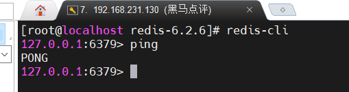


集成systemctl，配置开机自启动

新建文件

```shell
vi /etc/systemd/system/redis.service
```

内容如下

```shll
[Unit]
Description=redis-server
After=network.target

[Service]
Type=forking
ExecStart=/usr/local/bin/redis-server /usr/local/src/redis-6.2.6/redis.conf
PrivateTmp=true

[Install]
WantedBy=multi-user.target
```

然后重载系统服务：

```shell
systemctl daemon-reload
```

现在，我们可以用下面这组命令来操作redis了：

```shell
# 启动
systemctl start redis
# 停止
systemctl stop redis
# 重启
systemctl restart redis
# 查看状态
systemctl status redis
# 开机自启动
systemctl enable redis
# 查看开启自启动
systemctl is-enabled redis
```

## 2.redis使用

* 命令行客户端

  * ```shell
    redis-cli [options] [commonds]
    ```

    其中常见的options有：

    - `-h 127.0.0.1`：指定要连接的redis节点的IP地址，默认是127.0.0.1
    - `-p 6379`：指定要连接的redis节点的端口，默认是6379
    - `-a 123321`：指定redis的访问密码 
  
* 图形化客户端

  

  远程连接redis的时候要关闭防火墙。

* 编程客户端

## 4. 常用命令

Redis是一个key-value的数据库，key一般是String类型，不过value的类型多种多样：

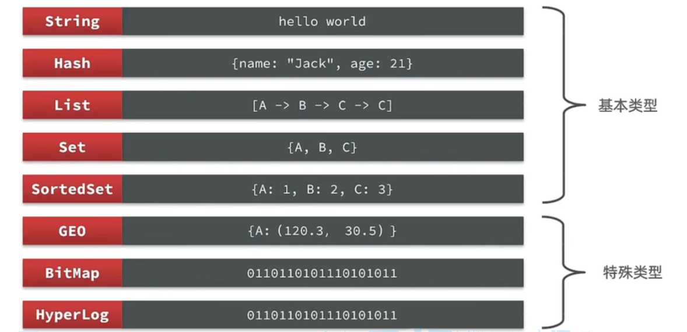

### 4.1 通用命令

* KEYS：查看符合模板的所有key
  * 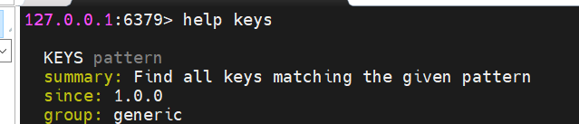
  * 在生产环境下，不推荐使用keys 命令，因为这个命令在key过多的情况下，效率不高，模糊查询。
* DEL：删除一个指定的key
  * 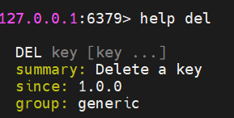
* EXISTS：判断key是否存在
  * 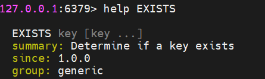
* EXPIRE: 设置一个key的有效时间，有效期到期时该key会被自动删除
  * 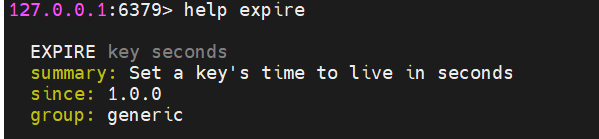
* TTL : 查看key的剩余有效时间
  * 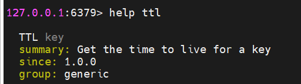
  * 返回值-2，表明查询的key有效期到期，并且已经删除
  * 返回值 -1，表示该key永久有效

### 4.2 String

String类型，也就是字符串类型，是Redis中最简单的存储类型。

其value是字符串，不过根据字符串的格式不同，又可以分为3类：

* string：普通字符串
* int：整数类型，可以做自增.自减操作
* float：浮点类型，可以做自增.自减操作
* 

​	

常见命令

- SET：添加或者修改已经存在的一个String类型的键值对
- GET：根据key获取String类型的value
- MSET：批量添加多个String类型的键值对
- MGET：根据多个key获取多个String类型的value
- INCR：让一个整型的key自增1
- INCRBY:让一个整型的key自增并指定步长，例如：incrby num 2 让num值自增2,incrby num -2,让num减2
- INCRBYFLOAT：让一个浮点类型的数字自增并指定步长
- SETNX：添加一个String类型的键值对，前提是这个key不存在，否则不执行
- SETEX：添加一个或者修改已经存在的一个String类型的键值对，并且指定有效期

### 4.3 Hash

Hash类型，也叫散列，其value是一个无序字典，类似于Java中的HashMap结构。

String结构是将对象序列化为JSON字符串后存储，当需要修改对象某个字段时很不方便：

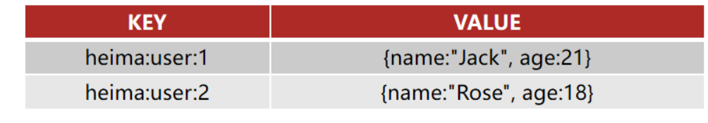

Hash结构可以将对象中的每个字段独立存储，可以针对单个字段做CRUD：

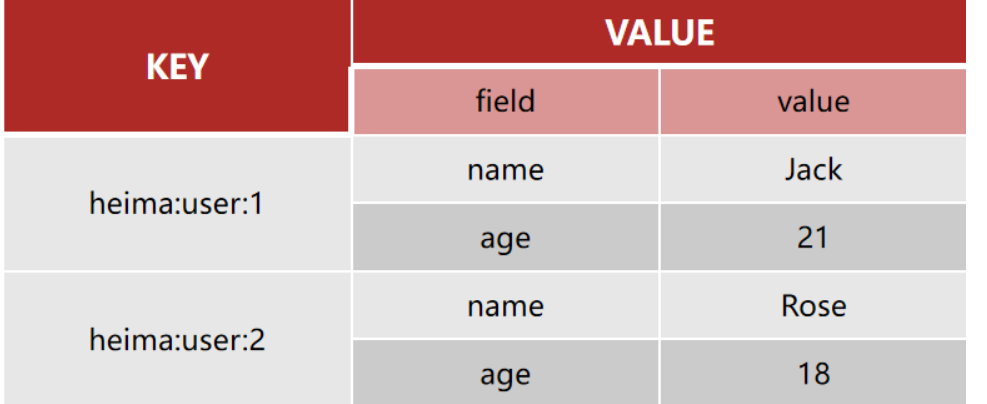

Hash数据类型常用命令

* HSET key field value：**添加或者修**改hash类型key的field的值
* HGET key field：获取一个hash类型key的field的值
* HMSET：批量添加多个hash类型key的field的值
* HMGET：批量获取多个hash类型key的field的值
* HGETALL：获取一个hash类型的key中的所有的field和value
* HKEYS：获取一个hash类型的key中的所有的field
* HINCRBY:让一个hash类型key的字段值自增并指定步长
* HSETNX：添加一个hash类型的key的field值，前提是这个field不存在，否则不执行

### 4.4List

Redis中的List类型与Java中的LinkedList类似，可以看做是一个双向链表结构。既可以支持正向检索和也可以支持反向检索。

特征也与LinkedList类似：

* 有序
* 元素可以重复
* 插入和删除快
* 查询速度一般

**常用来存储一个有序数据，例如：朋友圈点赞列表，评论列表等。**

**List常见命令有：**

* LPUSH key element ... ：向列表左侧插入一个或多个元素
* LPOP key：移除并返回列表左侧的第一个元素，没有则返回nil
* RPUSH key element ... ：向列表右侧插入一个或多个元素
* RPOP key：移除并返回列表右侧的第一个元素
* LRANGE key star end：返回一段角标范围内的所有元素
* BLPOP和BRPOP：与LPOP和RPOP类似，只不过在没有元素时等待指定时间，而不是直接返回nil

### 4.5 Set

Redis的Set结构与Java中的HashSet类似，可以看做是一个value为null的HashMap。因为也是一个hash表，因此具备与HashSet类似的特征：

* 无序
* 元素不可重复
* 查找快
* 支持交集.并集.差集等功能

**set常用命令有：**

* SADD key member ... ：向set中添加一个或多个元素
* SREM key member ... : 移除set中的指定元素
* SCARD key： 返回set中元素的个数
* SISMEMBER key member：判断一个元素是否存在于set中
* SMEMBERS：获取set中的所有元素
* SINTER key1 key2 ... ：求key1与key2的交集
* SDIFF key1 key2 ... ：求key1对于key2的差集
* SUNION key1 key2 ..：求key1和key2的并集


### 4.6SortedSet

Redis的SortedSet是一个可排序的set集合，与Java中的TreeSet有些类似，但底层数据结构却差别很大。SortedSet中的每一个元素都带有一个score属性，可以基于score属性对元素排序，底层的实现是一个跳表（SkipList）加 hash表。

SortedSet具备下列特性：

- 可排序
- 元素不重复
- 查询速度快

因为SortedSet的可排序特性，经常被用来实现排行榜这样的功能。

SortedSet的常见命令有：

- ZADD key score member：添加一个或多个元素到sorted set ，如果已经存在则更新其score值
- ZREM key member：删除sorted set中的一个指定元素
- ZSCORE key member : 获取sorted set中的指定元素的score值
- ZRANK key member：获取sorted set 中的指定元素的排名
- ZCARD key：获取sorted set中的元素个数
- ZCOUNT key min max：统计score值在给定范围内的所有元素的个数
- ZINCRBY key increment member：让sorted set中的指定元素自增，步长为指定的increment值
- ZRANGE key min max：按照score排序后，获取指定排名范围内的元素
- ZRANGEBYSCORE key min max：按照score排序后，获取指定score范围内的元素
- ZDIFF.ZINTER.ZUNION：求差集.交集.并集

注意：所有的排名默认都是升序，如果要降序则在命令的Z后面添加REV即可，例如：

- **升序**获取sorted set 中的指定元素的排名：ZRANK key member
- **降序**获取sorted set 中的指定元素的排名：ZREVRANK key memeber

## 5. redis的java客户端

在Redis官网中提供了各种语言的客户端，地址：https://redis.io/docs/clients/

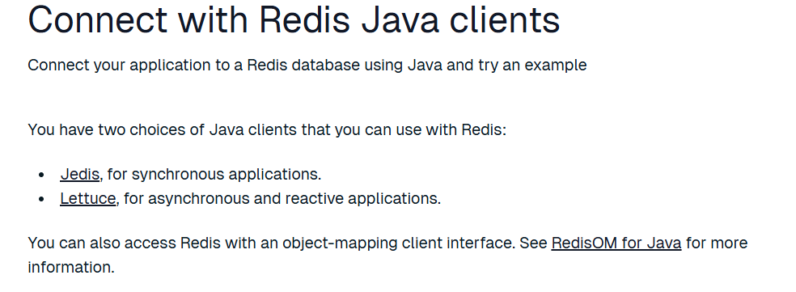

### 5.1 jedis快速入门

1. 引入依赖

   ```xml
   <dependency>
       <groupId>redis.clients</groupId>
       <artifactId>jedis</artifactId>
       <version>5.1.2</version>
   </dependency>
   ```

2. 建立连接使用

   ```java
   public class jredisTest {
   
       private Jedis jedis;
   
       @BeforeEach
       void setUp() {
           //建立连接
           jedis = new Jedis("192.168.231.130", 6379);
   
           //密码认证，由于没有设置redis密码就
   //      jedis.auth();
   
           //选择redis库 0-15
           jedis.select(0);
       }
   
       @Test
       void testString() {
           String result = jedis.set("name", "lishuo");
           System.out.println("result = " + result);
           String value = jedis.get("name");
           System.out.println("value = " + value);
       }
   
       @AfterEach
       void tearDown() {
           if (jedis != null){
               jedis.close();
           }
       }
   }
   ```

### 5.2 Jedis连接池

Jedis本身是线程不安全的，并且频繁的创建和销毁连接会有性能损耗，因此我们推荐大家使用Jedis连接池代替Jedis的直连方式。

* 创建连接池

  ```java
  public class JedisConnectionFactory {
  
      private  static  final JedisPool jedispool;
  
      static {
          JedisPoolConfig jedisPoolConfig = new JedisPoolConfig();
          //最大连接数
          jedisPoolConfig.setMaxTotal(8);
          //最大空闲连接
          jedisPoolConfig.setMaxIdle(8);
          //最小空闲连接
          jedisPoolConfig.setMinIdle(1);
          //等待时长，当没有连接可以使用，要等待多长时间
          jedisPoolConfig.setMaxWaitMillis(1000);
  
          jedispool = new JedisPool(jedisPoolConfig,"192.168.231.130",
                  6379,1000);
      }
  
      public static Jedis getJedis(){
          return jedispool.getResource();
      }
  
  }
  ```


