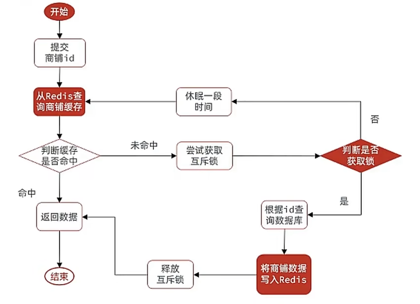

# redis快速入门

Redis的常见命令和客户端使用

## 1.初识Redis

Redis是一种键值型的NoSql数据库，这里有两个关键字：

- 键值型
- NoSql

其中**键值型**，是指Redis中存储的数据都是以key、value对的形式存储，而value的形式多种多样，可以是字符串、数值、甚至json：

而NoSql则是相对于传统关系型数据库而言，有很大差异的一种数据库。

**NoSql**可以翻译做Not Only Sql（不仅仅是SQL），或者是No Sql（非Sql的）数据库。是相对于传统关系型数据库而言，有很大差异的一种特殊的数据库，因此也称之为**非关系型数据库**。

* 结构化与非结构化

  * 传统关系型数据库是结构化数据，每一张表都有严格的约束信息：字段名、字段数据类型、字段约束等等信息，插入的数据必须遵守这些约束：

  * 而NoSql则对数据库格式没有严格约束，往往形式松散，自由。

    可以是键值型：

    也可以是文档型：

* 关联和非关联

  * 传统数据库的表与表之 间往往存在关联，例如外键：

* 查询方式

  * 传统关系型数据库会基于Sql语句做查询，语法有统一标准；

    而不同的非关系数据库查询语法差异极大，五花八门各种各样。

    

* 事务

  * 传统关系型数据库能满足事务ACID的原则。
  * 而非关系型数据库往往不支持事务，或者不能严格保证ACID的特性，只能实现基本的一致性。

* 存储方式

  * 关系型数据库基于磁盘进行存储，会有大量的磁盘IO，对性能有一定影响
  * 非关系型数据库，他们的操作更多的是依赖于内存来操作，内存的读写速度会非常快，性能自然会好一些

* 扩展性

  * 关系型数据库集群模式一般是主从，主从数据一致，起到数据备份的作用，称为垂直扩展。
  * 非关系型数据库可以将数据拆分，存储在不同机器上，可以保存海量数据，解决内存大小有限的问题。称为水平扩展。
  * 关系型数据库因为表之间存在关联关系，如果做水平扩展会给数据查询带来很多麻烦

* Redis的官方网站地址：https://redis.io/

## 2.redis下载

再contos7系统中

1. 安装redis依赖

Redis是基于C语言编写的，因此首先需要安装Redis所需要的gcc依赖：

```shell
yum install -y gcc tcl
```

此处报错


```shell

[root@localhost yum.repos.d]# yum install -y gcc tcl
已加载插件：fastestmirror, langpacks
Loading mirror speeds from cached hostfile
Could not retrieve mirrorlist http://mirrorlist.centos.org/?release=7&arch=x86_64&repo=os&infra=stock error was
14: curl#6 - "Could not resolve host: mirrorlist.centos.org; 未知的错误"


 One of the configured repositories failed (未知),
 and yum doesn't have enough cached data to continue. At this point the only
 safe thing yum can do is fail. There are a few ways to work "fix" this:

     1. Contact the upstream for the repository and get them to fix the problem.

     2. Reconfigure the baseurl/etc. for the repository, to point to a working
        upstream. This is most often useful if you are using a newer
        distribution release than is supported by the repository (and the
        packages for the previous distribution release still work).

     3. Run the command with the repository temporarily disabled
            yum --disablerepo=<repoid> ...

     4. Disable the repository permanently, so yum won't use it by default. Yum
        will then just ignore the repository until you permanently enable it
        again or use --enablerepo for temporary usage:

            yum-config-manager --disable <repoid>
        or
            subscription-manager repos --disable=<repoid>

     5. Configure the failing repository to be skipped, if it is unavailable.
        Note that yum will try to contact the repo. when it runs most commands,
        so will have to try and fail each time (and thus. yum will be be much
        slower). If it is a very temporary problem though, this is often a nice
        compromise:

            yum-config-manager --save --setopt=<repoid>.skip_if_unavailable=true

Cannot find a valid baseurl for repo: base/7/x86_64

```

不能够解析yum源，换yum源

1. 首先备份系统自带yum源配置文件/etc/yum.repos.d/CentOS-Base.repo 

```shell
mv /etc/yum.repos.d/CentOS-Base.repo /etc/yum.repos.d/CentOS-Base.repo.backup
```

2. 下载国内yum源配置文件到/etc/yum.repos.d/

   ```shell
   阿里源（推荐）：
   wget -O /etc/yum.repos.d/CentOS-Base.repo http://mirrors.aliyun.com/repo/Centos-7.repo
   网易源：
   wget -O /etc/yum.repos.d/CentOS-Base.repo http://mirrors.163.com/.help/CentOS7-Base-163.repo
   
   ```

   

3. 清理yum缓存，并生成新的缓存

   ```shell
   yum clean all
   yum makecache
   ```

4. 更新yum源检查是否生效

   ```shell
   更新yum源检查是否生效
   yum update
   ```

   解决错误，安装成功


2. 下载安装包，并上传到虚拟机

   例如，我放到了/usr/local/src 目录：

   

   解压：

   ```shell
   tar -xzf redis-6.2.6.tar.gz
   ```

3. 编译并安装

   进入redis目录

   ```shell
   cd redis-6.2.6
   ```

   运行编译命令：

   ```shell
   make && make install
   ```

   默认的安装路径是在 `/usr/local/bin`目录下：

   

   该目录已经默认配置到环境变量，因此可以在任意目录下运行这些命令。其中：

   - redis-cli：是redis提供的命令行客户端
   - redis-server：是redis的服务端启动脚本
   - redis-sentinel：是redis的哨兵启动脚本

## 3.redis配置

安装完成后

```shell
redis-server
```

启动，不过不能关闭这个启动的页面，要不然就关闭了这个服务，不推荐使用


如果要让Redis以`后台`方式启动，则必须修改Redis配置文件，就在我们之前解压的redis安装包下（`/usr/local/src/redis-6.2.6`），名字叫redis.conf：


先备份

```shell
cp redis.conf redis.conf.bck
```

然后修改redis.conf文件中的一些配置：

```shell
# 允许访问的地址，默认是127.0.0.1，会导致只能在本地访问。修改为0.0.0.0则可以在任意IP访问，生产环境不要设置为0.0.0.0
bind 0.0.0.0
# 守护进程，修改为yes后即可后台运行
daemonize yes 
#关闭保护模式，默认开启。开始保护模式后，远程访问必须进行认证后才能访问。
protected-mode no
# 密码，设置后访问Redis必须输入密码
requirepass 123321
```

redis其他配置

```shell
# 监听的端口
port 6379
# 工作目录，默认是当前目录，也就是运行redis-server时的命令，日志、持久化等文件会保存在这个目录
dir .
# 数据库数量，设置为1，代表只使用1个库，默认有16个库，编号0~15
databases 1
# 设置redis能够使用的最大内存
maxmemory 512mb
# 日志文件，默认为空，不记录日志，可以指定日志文件名
logfile "redis.log"
```

修改完配置文件后，就可以直接后端启动了。


集成systemctl，配置开机自启动

新建文件

```shell
vi /etc/systemd/system/redis.service
```

内容如下

```shll
[Unit]
Description=redis-server
After=network.target

[Service]
Type=forking
ExecStart=/usr/local/bin/redis-server /usr/local/src/redis-6.2.6/redis.conf
PrivateTmp=true

[Install]
WantedBy=multi-user.target
```

然后重载系统服务：

```shell
systemctl daemon-reload
```

现在，我们可以用下面这组命令来操作redis了：

```shell
# 启动
systemctl start redis
# 停止
systemctl stop redis
# 重启
systemctl restart redis
# 查看状态
systemctl status redis
# 开机自启动
systemctl enable redis
# 查看开启自启动
systemctl is-enabled redis
```

## 2.redis使用

* 命令行客户端

  * ```shell
    redis-cli [options] [commonds]
    ```

    其中常见的options有：

    - `-h 127.0.0.1`：指定要连接的redis节点的IP地址，默认是127.0.0.1
    - `-p 6379`：指定要连接的redis节点的端口，默认是6379
    - `-a 123321`：指定redis的访问密码 
  
* 图形化客户端

  

  远程连接redis的时候要关闭防火墙。

* 编程客户端

## 4. 常用命令

Redis是一个key-value的数据库，key一般是String类型，不过value的类型多种多样：


### 4.1 通用命令

* KEYS：查看符合模板的所有key
  * 
  * 在生产环境下，不推荐使用keys 命令，因为这个命令在key过多的情况下，效率不高，模糊查询。
* DEL：删除一个指定的key
  * 
* EXISTS：判断key是否存在
  * 
* EXPIRE: 设置一个key的有效时间，有效期到期时该key会被自动删除
  * 
* TTL : 查看key的剩余有效时间
  * 
  * 返回值-2，表明查询的key有效期到期，并且已经删除
  * 返回值 -1，表示该key永久有效

### 4.2 String

String类型，也就是字符串类型，是Redis中最简单的存储类型。

其value是字符串，不过根据字符串的格式不同，又可以分为3类：

* string：普通字符串
* int：整数类型，可以做自增.自减操作
* float：浮点类型，可以做自增.自减操作
* 

​	

常见命令

- SET：添加或者修改已经存在的一个String类型的键值对
- GET：根据key获取String类型的value
- MSET：批量添加多个String类型的键值对
- MGET：根据多个key获取多个String类型的value
- INCR：让一个整型的key自增1
- INCRBY:让一个整型的key自增并指定步长，例如：incrby num 2 让num值自增2,incrby num -2,让num减2
- INCRBYFLOAT：让一个浮点类型的数字自增并指定步长
- SETNX：添加一个String类型的键值对，前提是这个key不存在，否则不执行
- SETEX：添加一个或者修改已经存在的一个String类型的键值对，并且指定有效期

### 4.3 Hash

Hash类型，也叫散列，其value是一个无序字典，类似于Java中的HashMap结构。

String结构是将对象序列化为JSON字符串后存储，当需要修改对象某个字段时很不方便：


Hash结构可以将对象中的每个字段独立存储，可以针对单个字段做CRUD：


Hash数据类型常用命令

* HSET key field value：**添加或者修**改hash类型key的field的值
* HGET key field：获取一个hash类型key的field的值
* HMSET：批量添加多个hash类型key的field的值
* HMGET：批量获取多个hash类型key的field的值
* HGETALL：获取一个hash类型的key中的所有的field和value
* HKEYS：获取一个hash类型的key中的所有的field
* HINCRBY:让一个hash类型key的字段值自增并指定步长
* HSETNX：添加一个hash类型的key的field值，前提是这个field不存在，否则不执行

### 4.4List

Redis中的List类型与Java中的LinkedList类似，可以看做是一个双向链表结构。既可以支持正向检索和也可以支持反向检索。

特征也与LinkedList类似：

* 有序
* 元素可以重复
* 插入和删除快
* 查询速度一般

**常用来存储一个有序数据，例如：朋友圈点赞列表，评论列表等。**

**List常见命令有：**

* LPUSH key element ... ：向列表左侧插入一个或多个元素
* LPOP key：移除并返回列表左侧的第一个元素，没有则返回nil
* RPUSH key element ... ：向列表右侧插入一个或多个元素
* RPOP key：移除并返回列表右侧的第一个元素
* LRANGE key star end：返回一段角标范围内的所有元素
* BLPOP和BRPOP：与LPOP和RPOP类似，只不过在没有元素时等待指定时间，而不是直接返回nil

### 4.5 Set

Redis的Set结构与Java中的HashSet类似，可以看做是一个value为null的HashMap。因为也是一个hash表，因此具备与HashSet类似的特征：

* 无序
* 元素不可重复
* 查找快
* 支持交集.并集.差集等功能

**set常用命令有：**

* SADD key member ... ：向set中添加一个或多个元素
* SREM key member ... : 移除set中的指定元素
* SCARD key： 返回set中元素的个数
* SISMEMBER key member：判断一个元素是否存在于set中
* SMEMBERS：获取set中的所有元素
* SINTER key1 key2 ... ：求key1与key2的交集
* SDIFF key1 key2 ... ：求key1对于key2的差集
* SUNION key1 key2 ..：求key1和key2的并集


### 4.6SortedSet

Redis的SortedSet是一个可排序的set集合，与Java中的TreeSet有些类似，但底层数据结构却差别很大。SortedSet中的每一个元素都带有一个score属性，可以基于score属性对元素排序，底层的实现是一个跳表（SkipList）加 hash表。

SortedSet具备下列特性：

- 可排序
- 元素不重复
- 查询速度快

因为SortedSet的可排序特性，经常被用来实现排行榜这样的功能。

SortedSet的常见命令有：

- ZADD key score member：添加一个或多个元素到sorted set ，如果已经存在则更新其score值
- ZREM key member：删除sorted set中的一个指定元素
- ZSCORE key member : 获取sorted set中的指定元素的score值
- ZRANK key member：获取sorted set 中的指定元素的排名
- ZCARD key：获取sorted set中的元素个数
- ZCOUNT key min max：统计score值在给定范围内的所有元素的个数
- ZINCRBY key increment member：让sorted set中的指定元素自增，步长为指定的increment值
- ZRANGE key min max：按照score排序后，获取指定排名范围内的元素
- ZRANGEBYSCORE key min max：按照score排序后，获取指定score范围内的元素
- ZDIFF.ZINTER.ZUNION：求差集.交集.并集

注意：所有的排名默认都是升序，如果要降序则在命令的Z后面添加REV即可，例如：

- **升序**获取sorted set 中的指定元素的排名：ZRANK key member
- **降序**获取sorted set 中的指定元素的排名：ZREVRANK key memeber

## 5. redis的java客户端

在Redis官网中提供了各种语言的客户端，地址：https://redis.io/docs/clients/


### 5.1 jedis快速入门

1. 引入依赖

   ```xml
   <dependency>
       <groupId>redis.clients</groupId>
       <artifactId>jedis</artifactId>
       <version>5.1.2</version>
   </dependency>
   ```

2. 建立连接使用

   ```java
   public class jredisTest {
   
       private Jedis jedis;
   
       @BeforeEach
       void setUp() {
           //建立连接
           jedis = new Jedis("192.168.231.130", 6379);
   
           //密码认证，由于没有设置redis密码就
   //      jedis.auth();
   
           //选择redis库 0-15
           jedis.select(0);
       }
   
       @Test
       void testString() {
           String result = jedis.set("name", "lishuo");
           System.out.println("result = " + result);
           String value = jedis.get("name");
           System.out.println("value = " + value);
       }
   
       @AfterEach
       void tearDown() {
           if (jedis != null){
               jedis.close();
           }
       }
   }
   ```

### 5.2 Jedis连接池

Jedis本身是线程不安全的，并且频繁的创建和销毁连接会有性能损耗，因此我们推荐大家使用Jedis连接池代替Jedis的直连方式。

* 创建连接池

  ```java
  public class JedisConnectionFactory {
  
      private  static  final JedisPool jedispool;
  
      static {
          JedisPoolConfig jedisPoolConfig = new JedisPoolConfig();
          //最大连接数
          jedisPoolConfig.setMaxTotal(8);
          //最大空闲连接
          jedisPoolConfig.setMaxIdle(8);
          //最小空闲连接
          jedisPoolConfig.setMinIdle(1);
          //等待时长，当没有连接可以使用，要等待多长时间
          jedisPoolConfig.setMaxWaitMillis(1000);
  
          jedispool = new JedisPool(jedisPoolConfig,"192.168.231.130",
                  6379,1000);
      }
  
      public static Jedis getJedis(){
          return jedispool.getResource();
      }
  
  }
  ```


## 6 SpringDataRedis

SpringData是Spring中数据操作的模块，包含对各种数据库的集成，其中对Redis的集成模块就叫做SpringDataRedis，官网地址：https://spring.io/projects/spring-data-redis

* 提供了对不同Redis客户端的整合（Lettuce和Jedis）
* 提供了RedisTemplate统一API来操作Redis
* 支持Redis的发布订阅模型
* 支持Redis哨兵和Redis集群
* 支持基于Lettuce的响应式编程
* **支持基于JDK.JSON.字符串.Spring对象的数据序列化及反序列化**
* 支持基于Redis的JDKCollection实现

SpringDataRedis中提供了RedisTemplate工具类，其中封装了各种对Redis的操作。并且将不同数据类型的操作API封装到了不同的类型中：

   

### 6.1 快速入门

* 引入依赖

  ```java
  <dependency>
              <groupId>org.springframework.boot</groupId>
              <artifactId>spring-boot-starter-data-redis</artifactId>
   </dependency>
  ```

* 配置

  ```yaml
  spring:
    data:
      redis:
        host: 192.168.231.130
        port: 6379
        lettuce:
          pool:
            max-active: 8 #最大连接
            max-idle: 8 #最大空闲连接
            min-idle: 0 #最小空闲连接
            max-wait: 1000ms #连接等待时间
  ```

* 例子

  ```java
  @SpringBootTest
  class MainApplicationTest {
  
      @Autowired
      private RedisTemplate redisTemplate;
  
      @Test
      void testString(){
          ValueOperations valueOperations = redisTemplate.opsForValue();
          valueOperations.set("name0","hnsqls0");
          Object result = valueOperations.get("name0");
          System.out.println("result = " + result);
      }
  }
  ```

  

再linux上查看redis数据

查看发现没有name0，是没插入redis中？查看所有的key，发现有个乱码。


这是因为set的不是字符串。


### 6.2 数据序列化器

RedisTemplate可以接收任意Object作为值写入Redis：


只不过写入前会把Object序列化为字节形式，默认是采用JDK序列化，得到的结果是这样的：


缺点：

- 可读性差
- 内存占用较大


查看RedisTemplete源码


可以知道如果没有指定序列化器默认就是null，如果序列化器是null就采用jdk提供的序列化器。

为了解决这种问题，我们可以设置redis序列化器。

查看RedisSerializer的实现类


其中**StringRedisSerializer** 是序列化string类型的数据，再redis中key的值一般都是string类型，那么再序列化key的时候就可以选择该类型序列化器

其中**GenericJackson2RedisSerializer** 是序列化对象成为json的类型，序列化value就选用这个序列化器。


如何配置？

再配置类中添加bean  再com.ls.config.redis包下

```java
@Configuration
public class RedisConfig {

    @Bean
    public RedisTemplate<String, Object> redisTemplate(){

        RedisTemplate<String, Object> stringObjectRedisTemplate = new RedisTemplate<>();


        //创建连接工厂  RedisConnectionFactory redisConnectionFactory = new RedisConnectionFactory();
        RedisConnectionFactory redisConnectionFactory = new LettuceConnectionFactory();
       //RedisConnectionFactory redisConnectionFactory = new JedisConnectionFactory();

        //设置连接工厂
        stringObjectRedisTemplate.setConnectionFactory(redisConnectionFactory);

        //创建序列化器
        StringRedisSerializer stringRedisSerializer = new StringRedisSerializer();
        GenericJackson2JsonRedisSerializer genericJackson2JsonRedisSerializer = new GenericJackson2JsonRedisSerializer();

        //设置序列化器
        stringObjectRedisTemplate.setKeySerializer(stringRedisSerializer);
        stringObjectRedisTemplate.setHashKeySerializer(stringRedisSerializer);
        stringObjectRedisTemplate.setValueSerializer(genericJackson2JsonRedisSerializer);
        stringObjectRedisTemplate.setHashValueSerializer(genericJackson2JsonRedisSerializer);

        return stringObjectRedisTemplate;
    }
}

```

测试类

```java
@SpringBootTest
class MainApplicationTest {

    @Autowired
    private RedisTemplate<String, Object> redisTemplate;

    @Test
    void testString(){
        ValueOperations valueOperations = redisTemplate.opsForValue();
        valueOperations.set("name0","hnsqls0");

        Object result = valueOperations.get("name0");
        System.out.println("result = " + result);
    }
}
```


没有jackson处理类，引入jackson依赖

```xml
  <dependency>
            <groupId>com.fasterxml.jackson.core</groupId>
            <artifactId>jackson-databind</artifactId>
        </dependency>
```

还是错误


再配置连接工厂的时候错误，但是不明白为什么


这样就可以运行成功，不明白，而且这个用接口接收值，是接收的Lettuer还是Jedis连接工厂，为什么那样错？

查看结果，显示正常


存一个对象看看序列结果

新建User类，com.ls.pojo

```xml
        <dependency>
            <groupId>org.projectlombok</groupId>
            <artifactId>lombok</artifactId>
        </dependency>
```

```java
@Data
@AllArgsConstructor
public class User {
    private String name;
    private int age;
}
```

测试类

```java
    @Test
    void TestSavaUser(){
        redisTemplate.opsForValue()
                .set("test:user:100",new User("hnsqls",21));

        User o = (User) redisTemplate.opsForValue().get("test:user:100");
        System.out.println("o = " + o);
    }
```


反序列化失败，原因是jason反序列化对象时，对象没有提供无参构造器或setget方法，此处我们没有提供无参构造方法

```java
@Data
@AllArgsConstructor
@NoArgsConstructor //反序列化需要
public class User {
    private String name;
    private int age;
}
```


再redis中多存入了类名，占用了内存开销，但是自动反序列话又需要。

### 6.3 StringRedisTemplate

尽管JSON的序列化方式可以满足我们的需求，但依然存在一些问题,为了在反序列化时知道对象的类型，JSON序列化器会将类的class类型写入json结果中，存入Redis，会带来额外的内存开销。


为了减少内存开销，我们都使用string类型处理，当需要对象的时候再手动转化


这种用法比较普遍，因此SpringDataRedis就提供了RedisTemplate的子类：StringRedisTemplate，它的key和value的序列化方式默认就是String方式。


测试类

```java

    @Autowired
    private StringRedisTemplate stringRedisTemplate;


    @Test
    void testString(){
        ValueOperations valueOperations = stringRedisTemplate.opsForValue();
        valueOperations.set("test:stringRedis:user:1","hnsqls0");

        Object result = valueOperations.get("name0");
        System.out.println("result = " + result);
    }
```

结果


测试类---》对象

```java
     @Autowired
    private StringRedisTemplate stringRedisTemplate;

    //序列化反序列话工具
    private static final ObjectMapper mapper = new ObjectMapper();

	@Test
    void TestSavaUser() throws JsonProcessingException {

        User user = new User("hnsqls02",21);

        //序列化
        String json = mapper.writeValueAsString(user);

        //存入redis
        stringRedisTemplate.opsForValue()
                .set("test:stringRedis:user:2",json);

        //从redis取数据
        String json1 = stringRedisTemplate.opsForValue()
                .get("test:stringRedis:user:2");

        //反序列化
        User user1 = mapper.readValue(json1, User.class);
        System.out.println("user1 = " + user1);

    }
```


正常显示，并且没有额外占用内存。


# 项目实战

## 1. 准备

### 1.1 后端初始化


1. 新建数据库，导入sql文件

   

2.  导入初始化代码

   修改redis配置和mysql配置
   
3. 启动测试

```java
Caused by: java.lang.IllegalArgumentException: Unsupported class file major version 61
	at org.springframework.asm.ClassReader.<init>(ClassReader.java:196) ~[spring-core-5.2.15.RELEASE.jar:5.2.15.RELEASE]
	at org.springframework.asm.ClassReader.<init>(ClassReader.java:177) ~[spring-core-5.2.15.RELEASE.jar:5.2.15.RELEASE]
	at org.springframework.asm.ClassReader.<init>(ClassReader.java:163) ~[spring-core-5.2.15.RELEASE.jar:5.2.15.RELEASE]
	at org.springframework.asm.ClassReader.<init>(ClassReader.java:284) ~[spring-core-5.2.15.RELEASE.jar:5.2.15.RELEASE]
	at org.springframework.core.type.classreading.SimpleMetadataReader.getClassReader(SimpleMetadataReader.java:57) ~[spring-core-5.2.15.RELEASE.jar:5.2.15.RELEASE]
	... 25 common frames omitted
```


原因是jdk和springboot版本不匹配，我的jdk是17，而项目中的springboot是2.3.1。换jdk为8。


修改sdk


修改语言级别


修改java编译器


不知为什么，每次刷新maven级别又重新回到17，或许是maven中配置的jdk17的原因。

成功启动

4. 测试
访问localhost:8081/shop-type/list

   有数据就是成功。
   
   
### 1.2前端初始化

双击nginx.exe


访问8080即可，但是拒绝访问找不到、查看日志文件


```sh
2024/08/02 13:34:12 [emerg] 3448#4380: CreateFile() "E:\Font_Develepment\黑马点评\nginx-1.18.0/conf/nginx.conf" failed (1113: No mapping for the Unicode character exists in the target multi-byte code page)
```

路径有中文。修改黑马点评为hmdp

启动成功


## 2. 登录和注册

### 2.1 登录和注册流程

* 一基于Session的认证
  * 认证流程
    * 用户输入账号和密码进行登录。

    * 服务器验证用户信息，如果验证通过，则在服务端生成用户相关的数据保存在Session中（当前会话）。

    * 服务器将Session ID发送给客户端，并存储在客户端的Cookie中。

    * 客户端后续请求时，会带上Session ID，服务器通过验证Session ID来确认用户的身份和会话状态。

    * 当用户退出系统或Session过期销毁时，客户端的Session ID也随之失效。

* 优点
  * 实现简单，易于理解和维护。
  * Session信息存储在服务器端，相对安全。
* 缺点

  * 服务器需要维护大量的Session信息，增加了服务器的存储负担。
  * Session ID存储在客户端的Cookie中，如果Cookie被窃取，则存在安全风险。
  * Session认证通常依赖于客户端的Cookie，无状态的服务器无法直接识别用户身份。
* 适用场景
  * 适用于用户数量相对较少、服务器资源相对充足的应用场景。
  * 适用于需要频繁进行状态保持的应用场景，如Web应用中的用户登录状态保持。


1. **发送验证码：**

​	校验前端发来的手机号是否合法。（前端也要校验，减少不合法的请求，减轻服务器压力，后端也要校验，因为前端校验可以被绕过。）

​	生成验证码

​	验证码保存到session，并响应给前端。

2. **登录或注册**

   校验验证码是否正确。

   校验手机号是否存在于数据库，**若存在就是登录，保用户到session**；若不存在就是注册，**添加些基本信息保存到数据库中并保存用户到session。**

3. **校验登录状态:**

   用户在请求时候，会从cookie中携带者JsessionId到后台，后台通过JsessionId从session中拿到用户信息，如果没有session信息，则进行拦截，如果有session信息，则将用户信息保存到threadLocal中，并且放行

   


### 2.2 发送验证码接口


* 说明
  * 请求方式 ：POST
  * 请求路径 ： /user/code
  * 请求参数： phone
  * 返回值： 无


在userController中

* controller

```java
    /**
     * 发送手机验证码
     */
    @PostMapping("code")
    public Result sendCode(@RequestParam("phone") String phone, HttpSession session) {
        // TODO 发送短信验证码并保存验证码

        return  userService.sendCode(phone,session);
    }

```

* service

  ```java
  //接口
  Result sendCode(String phone, HttpSession session);
  
  //实现类
   /**
       * 发送短信验证码
       * @param phone
       * @param session
       */
      @Override
      public Result sendCode(String phone, HttpSession session) {
          //判断手机号是否合法
          if(RegexUtils.isPhoneInvalid(phone)){
              //不合法， 就返回不符合
              return Result.fail("手机号不合法");
          }
          //合法  生成验证码
          String code = RandomUtil.randomNumbers(6);
  
          //保存到session中
          session.setAttribute("code",code);
  
          //发送验证码到手机   sms服务，先假装发送可以记录到日志中
          log.debug("发送验证码成功,验证码:{}",code);
          return Result.ok();
      }
  ```

其中，判断手机号是否合法是自己写的工具类

正则匹配的格式

```java
public abstract class RegexPatterns {
    /**
     * 手机号正则
     */
    public static final String PHONE_REGEX = "^1([38][0-9]|4[579]|5[0-3,5-9]|6[6]|7[0135678]|9[89])\\d{8}$";
    /**
     * 邮箱正则
     */
    public static final String EMAIL_REGEX = "^[a-zA-Z0-9_-]+@[a-zA-Z0-9_-]+(\\.[a-zA-Z0-9_-]+)+$";
    /**
     * 密码正则。4~32位的字母、数字、下划线
     */
    public static final String PASSWORD_REGEX = "^\\w{4,32}$";
    /**
     * 验证码正则, 6位数字或字母
     */
    public static final String VERIFY_CODE_REGEX = "^[a-zA-Z\\d]{6}$";

}
```

匹配正则的方法

```java
public class RegexUtils {
    /**
     * 是否是无效手机格式
     * @param phone 要校验的手机号
     * @return true:符合，false：不符合
     */
    public static boolean isPhoneInvalid(String phone){
        return mismatch(phone, RegexPatterns.PHONE_REGEX);
    }
    /**
     * 是否是无效邮箱格式
     * @param email 要校验的邮箱
     * @return true:符合，false：不符合
     */
    public static boolean isEmailInvalid(String email){
        return mismatch(email, RegexPatterns.EMAIL_REGEX);
    }

    /**
     * 是否是无效验证码格式
     * @param code 要校验的验证码
     * @return true:符合，false：不符合
     */
    public static boolean isCodeInvalid(String code){
        return mismatch(code, RegexPatterns.VERIFY_CODE_REGEX);
    }

    // 校验是否不符合正则格式
    private static boolean mismatch(String str, String regex){
        if (StrUtil.isBlank(str)) {
            return true;
        }
        return !str.matches(regex);
    }
}
```

StrUtil.isBlank(str)  使用了第三方提共的工具类

生成验证码        String code = RandomUtil.randomNumbers(6);

```xml
        <!--hutool-->
        <dependency>
            <groupId>cn.hutool</groupId>
            <artifactId>hutool-all</artifactId>
            <version>5.7.17</version>
        </dependency>
```

### 2.3 登录和注册接口


* 说明
  * 请求类型 ：POST
  * 请求路径：user/login
  * 请求数据结构：json串，phone，code
  * 
  * 返回值： 无


* controller

  ```java
      /**
       * 登录功能
       * @param loginForm 登录参数，包含手机号、验证码；或者手机号、密码
       */
      @PostMapping("/login")
      public Result login(@RequestBody LoginFormDTO loginForm, HttpSession session){
          // TODO 实现登录功能
          return userService.login(loginForm,session);
      }
  
  ```

* service

  ```java
  Result login(LoginFormDTO loginForm, HttpSession session);
  
   /**
       * 登录或注册用户
       * @param loginForm
       * @param session
       * @return
       */
      @Override
      public Result login(LoginFormDTO loginForm, HttpSession session) {
          //校验验证码
          String cacheCode = session.getAttribute("code").toString();
          String code = loginForm.getCode();
          if (!code.equals(cacheCode)){
              //验证码不相同
              return Result.fail("验证码错误");
          }
  
          //根据手机号判断用户是否存在
          LambdaQueryWrapper<User> queryWrapper = new LambdaQueryWrapper<>();
          queryWrapper.eq(User::getPhone,loginForm.getPhone());
          User user = super.getOne(queryWrapper);
          if (user ==null){
              //用户不存在，注册用户，填上基本信息,保存
              User user1 = new User();
              user1.setPhone(loginForm.getPhone());
              user1.setNickName("user_"+RandomUtil.randomString(4));
              user = user1;
              //保存到数据库中
              super.save(user1);
          }
          //用户存在就保存在session
          session.setAttribute("user",user);
  
          return Result.ok() ;
      }
  ```


### 2. 4 校验用户，配置拦截器

由于很多页面需要登录才能访问，所以每个请求都要验证用户信息，才能访问。要是一个一个写就太冗余了，可以利用springmvc的拦截器，将需要验证用户的请求都拦截，然后再拦截器中校验用户。

而且请求有时候也会用用户的信息，可以再拦截器中校验用户并保存用户信息到ThreadLocal中，这样该用户之后的请求都能从ThreadLocal中获取用户信息。

* ThreadLocal

```java
public class UserHolder {
    private static final ThreadLocal<UserDTO> tl = new ThreadLocal<>();

    public static void saveUser(UserDTO user){
        tl.set(user);
    }

    public static UserDTO getUser(){
        return tl.get();
    }

    public static void removeUser(){
        tl.remove();
    }
}
```

* 拦截器

  ```java
  @Component
  public class LoginInterceptor implements HandlerInterceptor {
      @Override
      public boolean preHandle(HttpServletRequest request, HttpServletResponse response, Object handler) throws Exception {
          //1. 获取session
          HttpSession session = request.getSession();
          // 2. 获取session中的用户
          Object user = session.getAttribute("user");
          if (user == null) {
              //没有用户信息
              response.setStatus(401);
              return false;
          }
          //3. 保存到ThreadLocal中
          UserHolder.saveUser((UserDTO) user);
  
          return true;
      }
  
      @Override
      public void afterCompletion(HttpServletRequest request, HttpServletResponse response, Object handler, Exception ex) throws Exception {
         //移除信息，避免内存泄露
          UserHolder.removeUser();
      }
  }
  ```

* 拦截器配置

  ```java
  @Configuration
  public class WebMvcConfig implements WebMvcConfigurer {
      @Autowired
      private LoginInterceptor loginInterceptor;
      @Override
      public void addInterceptors(InterceptorRegistry registry) {
          registry.addInterceptor(loginInterceptor)
                  .excludePathPatterns(
                          "/user/code",
                          "/user/login"
                  );
  
      }
  }
  ```

* 校验用户接口

  * service

    ```java
        @GetMapping("/me")
        public Result me(){
            //获取当前登录的用户并返回
            return Result.ok(UserHolder.getUser());
        }
    ```


### 2.5 处理登录敏感信息

  在校验登录的时候，我们通过ThreadLocal将用户登录信息存在了session中，我们查看我们返回的数据，这里面有敏感信息不安全，也有无用信息createtime，updatatime。这些不但会泄露敏感信息而且会占用tomcat服务器的内存。所以说这些信息我们不需要，有两种解决方法

* 一：定义一个登录用户类，仅仅有必要的属性，仅用于用户的验证。在ThreadLocal中存这个登录的类的信息。
* 二：在用户类上添加@JsonIgnore
  * `@JsonIgnore` 是 Jackson 库中的一个注解，用于 JSON 序列化和反序列化过程中忽略指定的字段。


这里我使用第二种： 修改user类，添加@JsonIgnore 忽略字段

```java
@Data
@EqualsAndHashCode(callSuper = false)
@Accessors(chain = true)
@TableName("tb_user")
public class User implements Serializable {

    private static final long serialVersionUID = 1L;

    /**
     * 主键
     */
    @TableId(value = "id", type = IdType.AUTO)
    private Long id;

    /**
     * 手机号码
     */
    @JsonIgnore
    private String phone;

    /**
     * 密码，加密存储
     */
    @JsonIgnore
    private String password;

    /**
     * 昵称，默认是随机字符
     */
    private String nickName;

    /**
     * 用户头像
     */
    private String icon = "";

    /**
     * 创建时间
     */
    @JsonIgnore
    private LocalDateTime createTime;

    /**
     * 更新时间
     */
    @JsonIgnore
    private LocalDateTime updateTime;


}

```


### 2.6 集群的session共享问题

**核心思路分析：**

每个tomcat中都有一份属于自己的session,假设用户第一次访问第一台tomcat，并且把自己的信息存放到第一台服务器的session中，但是第二次这个用户访问到了第二台tomcat，那么在第二台服务器上，肯定没有第一台服务器存放的session，所以此时 整个登录拦截功能就会出现问题，我们能如何解决这个问题呢？早期的方案是session拷贝，就是说虽然每个tomcat上都有不同的session，但是每当任意一台服务器的session修改时，都会同步给其他的Tomcat服务器的session，这样的话，就可以实现session的共享了。

但是这种方案具有两个大问题

1、每台服务器中都有完整的一份session数据，服务器压力过大。

2、session拷贝数据时，可能会出现延迟


****

**所以咱们后来采用的方案都是基于redis来完成，我们把session换成redis，redis数据本身就是共享的，就可以避免session共享的问题了**

### 2.7 用redis解决session共享问题

简单来说，把session的数据（sessionid验证用户）存到redis中。我们可以不要sessionid，定义一个token唯一作为k，验证码作为v。

如果我们采用phone：手机号这个的数据来存储当然是可以的，但是如果把这样的敏感数据存储到redis中并且从页面中带过来毕竟不太合适，所以我们在后台生成一个随机串token，然后让前端带来这个token就能完成我们的整体逻辑了。

**明确整体访问流程**

在用户去登录时会去校验用户提交的手机号和验证码，是否一致，如果一致，则根据手机号查询用户信息，不存在则新建，最后将用户数据保存到redis，并且生成token作为redis的key，当我们校验用户是否登录时，会去携带着token进行访问，从redis中取出token对应的value，判断是否存在这个数据，如果没有则拦截，如果存在则将其保存到threadLocal中，并且放行。


**注意：使用session时候浏览器在请求的时候自动带了sessionid，我们使用redis+token，浏览器并不能自动携带，需要前端请求的时候携带**


* 发送短信验证码接口优化

  我们之前是将验证码存在session中，但是为了解决session共享问题，我们使用redis。业务逻辑有所改变。

  1. 校验手机号是否合法
     1. 不合法：提示手机号不合法
     2. 合法： 通过短信服务发送验证码，并以手机号为key，验证码为value存在redis中。

  ```java
   @Autowired
      private  StringRedisTemplate redisTemplate;
      /**
       * 发送短信验证码
       * @param phone
       * @param session
       */
      @Override
      public Result sendCode(String phone, HttpSession session) {
          //判断手机号是否合法
          if(RegexUtils.isPhoneInvalid(phone)){
              //不合法， 就返回不符合
              return Result.fail("手机号不合法");
          }
          //合法  生成验证码
          String code = RandomUtil.randomNumbers(6);
  
          //保存到session中
          //session.setAttribute("code",code);
          
          //以手机号为k，手机验证码为v 保存在redis中
           redisTemplate.opsForValue().set(phone,code,60, TimeUnit.SECONDS);
  
          //发送验证码到手机   sms服务，先假装发送可以记录到日志中
          log.debug("发送验证码成功,验证码:{}",code);
          return Result.ok();
      }
  ```

* 登录和注册接口优化

  业务逻辑

  1. 验证手机号和验证码是否一致
     1. 若一致 
        1. 根据手机号查询DB是否存在该用户
           1. 不存在，就是注册，填上用户基本信息保存到数据库中，并以随机token为k，用户信息为v存在redis中。
           2. 存在，以随机token为k，用户信息为v存在redis中
     2. 若不一致，提示验证码错误。
  2. 返回给前端token

  ```java
        /**
       * 登录或注册用户
       * @param loginForm
       * @param session
       * @return
       */
      @Override
      public Result login(LoginFormDTO loginForm, HttpSession session) {
          //校验验证码
  //        String cacheCode = session.getAttribute("code").toString();
          String cacheCode = redisTemplate.opsForValue().get(RedisConstants.LOGIN_CODE_KEY + loginForm.getPhone());
          String code = loginForm.getCode();
          if (!code.equals(cacheCode)){
              //验证码不相同
              return Result.fail("验证码错误");
          }
  
          //根据手机号判断用户是否存在
          LambdaQueryWrapper<User> queryWrapper = new LambdaQueryWrapper<>();
          queryWrapper.eq(User::getPhone,loginForm.getPhone());
          User user = super.getOne(queryWrapper);
          if (user ==null){
              //用户不存在，注册用户，填上基本信息,保存
              User user1 = new User();
              user1.setPhone(loginForm.getPhone());
              user1.setNickName("user_"+RandomUtil.randomString(4));
              user = user1;
              //保存到数据库中
              super.save(user1);
          }
          //用户存在就保存在session
          //session.setAttribute("user",user);
  
          //用户信息保存在redis中  以随机token为k,用户信息为v
          String token = UUID.randomUUID().toString(true);
          //将对象转为hash类型
          Map<String, Object> usermap = BeanUtil.beanToMap(user,new HashMap<>(),
                  CopyOptions.create()
                          .setIgnoreNullValue(true)
                          .setFieldValueEditor((fieldName,fieldValue) -> fieldValue.toString()));
          //存在redis中
          redisTemplate.opsForHash().putAll(RedisConstants.LOGIN_USER_KEY+token,usermap);
          //设置token有效期
          redisTemplate.expire(RedisConstants.LOGIN_USER_KEY +token,12,TimeUnit.HOURS);
  
          //返回token
          return Result.ok(token) ;
      }
  ```
  
  改造拦截器
  
  ```java
  //@Component  拦截器是非常轻量级的组件，只有再需要时才会被调用
  public class LoginInterceptor implements HandlerInterceptor {
  
  
      private StringRedisTemplate stringRedisTemplate;
  
      public LoginInterceptor(StringRedisTemplate stringRedisTemplate) {
          this.stringRedisTemplate = stringRedisTemplate;
      }
  
      @Override
      public boolean preHandle(HttpServletRequest request, HttpServletResponse response, Object handler) throws Exception {
  //        //1. 获取session
  //        HttpSession session = request.getSession();
  //        // 2. 获取session中的用户
  //        Object user = session.getAttribute("user");
  //        if (user == null) {
  //            //没有用户信息
  //            response.setStatus(401);
  //            return false;
  //        }
  //        //3. 保存到ThreadLocal中
  //        UserHolder.saveUser((User) user);
  //
  //        return true;
  
          // TODO 1. 获取token
          String token = request.getHeader("authorization");
          if (StrUtil.isBlank(token)) {
              //为空
              response.setStatus(401);
              return  false;
          }
  
          // TODO 2.基于token获取redis中的用户
          Map<Object, Object> objectMap = stringRedisTemplate.opsForHash().entries(RedisConstants.LOGIN_USER_KEY+token);
          //判断用户是否存在
          if (objectMap.isEmpty()){
              //不存在
              response.setStatus(401);
              return false;
          }
          //将map转对象
          User user = BeanUtil.fillBeanWithMap(objectMap, new User(), false);
  
          //保存再threadLocal
          UserHolder.saveUser(user);
  
          stringRedisTemplate.expire(RedisConstants.LOGIN_USER_KEY+token,RedisConstants.LOGIN_USER_TTL, TimeUnit.SECONDS);
  
          return true;
  
      }
  
      @Override
      public void afterCompletion(HttpServletRequest request, HttpServletResponse response, Object handler, Exception ex) throws Exception {
         //移除信息，避免内存泄露
          UserHolder.removeUser();
      }
  }
  
  ```

  

## 3. 商户缓存

### 3.1 什么是缓存


### 3.2 添加商户缓存

* 业务流程

  

* controller

  ```java
      /**
       * 根据id查询商铺信息
       * @param id 商铺id
       * @return 商铺详情数据
       */
      @GetMapping("/{id}")
      public Result queryShopById(@PathVariable("id") Long id) {
          return shopService.queryById(id);
      }
  ```

* service

```java
 Result queryById(Long id);

 @Override
    public Result queryById(Long id) {
        String shopKey = CACHE_SHOP_KEY+ id;

        // 1. 从redis中查询店铺缓存
        String shopJson = stringRedisTemplate.opsForValue().get(shopKey);

        //2.判断是否命中缓存
        if(StrUtil.isNotBlank(shopJson )){
            // 3.若命中则返回信息
            Shop shop = JSONUtil.toBean(shopJson, Shop.class);
            return Result.ok(shop);
        }
        //4.没有命中缓存，查数据库
        Shop shop = super.getById(id);
        //5. 数据库为空，返回错误
        if (shop == null){
            return Result.fail("没有该商户信息");
        }
        //6. 数据库不为空，返回查询的结果并加入缓存
        stringRedisTemplate.opsForValue().set(CACHE_SHOP_KEY+ id, JSONUtil.toJsonStr(shop));
        return Result.ok(shop);
    }
```

### 3.3 缓存的更新策略

缓存更新是redis为了节约内存而设计出来的一个东西，主要是因为内存数据宝贵，当我们向redis插入太多数据，此时就可能会导致缓存中的数据过多，所以redis会对部分数据进行更新，或者把他叫为淘汰更合适。

**内存淘汰：**redis自动进行，当redis内存达到咱们设定的max-memery的时候，会自动触发淘汰机制，淘汰掉一些不重要的数据(可以自己设置策略方式)

**超时剔除：**当我们给redis设置了过期时间ttl之后，redis会将超时的数据进行删除，方便咱们继续使用缓存

**主动更新：**我们可以手动调用方法把缓存删掉，通常用于解决缓存和数据库不一致问题


### 3.4缓存的一致性问题

因为数据库是变化着的，而缓存的数据是来源于数据库。缓存没有跟着数据库同步，就会出现数据一致性的问题。

解决方法

Cache Aside Pattern 人工编码方式：缓存调用者在更新完数据库后再去更新缓存，也称之为双写方案

Read/Write Through Pattern : 由系统本身完成，数据库与缓存的问题交由系统本身去处理

Write Behind Caching Pattern ：调用者只操作缓存，其他线程去异步处理数据库，实现最终一致


通常使用第一种方案，来确保缓存一致性问题。

如果采用第一个方案，那么假设我们每次操作数据库后，都操作缓存，但是中间如果没有人查询，那么这个更新动作实际上只有最后一次生效，中间的更新动作意义并不大，我们可以把缓存删除，等待再次查询时，将缓存中的数据加载出来

我们需要考虑一下几点

1. 在数据库更新时，缓存是更新还是删除？

   1. 更新缓存：每次更新数据库都更新缓存，无效写操作较多
   2. 删除缓存：更新数据库时让缓存失效，查询时再更新缓存

2. 怎么确保数据库更新，缓存也更新（删除），

   1. 单体系统，将缓存与数据库操作放在一个事务
   2. 分布式系统，利用TCC等分布式事务方案

   

3.  先操作缓存还是先操作数据库？
     * 先删除缓存，再操作数据库
     * 先操作数据库，再删除缓存
    
    应该具体操作缓存还是操作数据库，我们应当是先操作数据库，再删除缓存，原因在于，如果你选择第一种方案，在两个线程并发来访问时，假设线程1先来，他先把缓存删了，此时线程2过来，他查询缓存数据并不存在，此时他写入缓存，当他写入缓存后，线程1再执行更新动作时，实际上写入的就是旧的数据，新的数据被旧数据覆盖了。


### 3.5 实现店铺缓存的一致性

1)在查看店铺信息时添加ttl

2）在更新店铺时先操作数据库在删除缓存加上事务


### 3.6缓存穿透问题

缓存穿透：当请求的数据在数据库中和缓存都不存在时，该请求数据的请求就会直接请求数据库而且相同数据的请求还是知道请求数据库，这个不可能有缓存。

常见的解决方案有两种：

* 缓存空对象
  * 优点：实现简单，维护方便
  * 缺点：
    * 额外的内存消耗（无用的缓存）
    * 可能造成短期的不一致
* 布隆过滤
  * 优点：内存占用较少，没有多余key
  * 缺点：
    * 实现复杂
    * 存在误判可能


第一种缓存空对象的实现思路：当客户端请求的数据在数据库中不存在，在请求过程中先请求redis，发现redis中，没有，在请求数据库，数据库中也不存在。之后相同的请求也会直接请求到数据库，如果有不法用户恶意同时大量发送这样的请求，对数据库服务器造成压力甚至宕机。我们可以这样解决，当请求的数据不存在，我们对这个不存在的数据置为null，并加入redis缓存中，这样之后相同的请求就会在redis中找到为null。


第二种就是使用布隆过滤器，请求先经过布隆过滤器的判断，存不存在在，不存在就直接返回，存在在请求redis或数据库

这种方式优点在于节约内存空间，存在误判，误判原因在于：布隆过滤器走的是哈希思想，只要哈希思想，就可能存在哈希冲突


### 3.7 实现商户信息缓存穿透问题

熟练业务逻辑：

使用缓存空对象

​	当客户端发起请求，该请求的参数在数据库中不存在，将空值写入redis并设置ttl 并且返回空置。


isNotBlank情况如下


核心业务代码


总结

缓存穿透产生的原因是什么？

* 用户请求的数据在缓存中和数据库中都不存在，不断发起这样的请求，给数据库带来巨大压力

缓存穿透的解决方案有哪些？

* 缓存null值
* 布隆过滤
* 增强id的复杂度，避免被猜测id规律
* 做好数据的基础格式校验
* 加强用户权限校验
* 做好热点参数的限流


### 3.8 缓存雪崩问题

缓存雪崩是指在同一时段大量的缓存key同时失效或者Redis服务宕机，导致大量请求到达数据库，带来巨大压力。

解决方案：

* 给不同的Key的TTL添加随机值
* 利用Redis集群提高服务的可用性
* 给缓存业务添加降级限流策略
* 给业务添加多级缓存


### 3.9缓存击穿问题

缓存击穿问题也叫热点Key问题，就是一个被高并发访问并且缓存重建业务较复杂的key突然失效了，无数的请求访问会在瞬间给数据库带来巨大的冲击。

逻辑分析：假设线程1在查询缓存之后，本来应该去查询数据库，然后把这个数据重新加载到缓存的，此时只要线程1走完这个逻辑，其他线程就都能从缓存中加载这些数据了，但是假设在线程1没有走完的时候，后续的线程2，线程3，线程4同时过来访问当前这个方法， 那么这些线程都不能从缓存中查询到数据，那么他们就会同一时刻来访问查询缓存，都没查到，接着同一时间去访问数据库，同时的去执行数据库代码，对数据库访问压力过大


常见的解决方案有两种：

* 互斥锁
* 逻辑过期


第一种解决方案:

因为锁能实现互斥性。假设线程过来，只能一个人一个人的来访问数据库，从而避免对于数据库访问压力过大，但这也会影响查询的性能，因为此时会让查询的性能从并行变成了串行，我们可以采用tryLock方法 + double check来解决这样的问题。


假设现在线程1过来访问，他查询缓存没有命中，但是此时他获得到了锁的资源，那么线程1就会一个人去执行逻辑，假设现在线程2过来，线程2在执行过程中，并没有获得到锁，那么线程2就可以进行到休眠，直到线程1把锁释放后，线程2获得到锁，然后再来执行逻辑，此时就能够从缓存中拿到数据了。


解决方案二、逻辑过期方案

方案分析：我们之所以会出现这个缓存击穿问题，主要原因是在于我们对key设置了过期时间，假设我们不设置过期时间，其实就不会有缓存击穿的问题，但是不设置过期时间，这样数据不就一直占用我们内存了吗，我们可以采用逻辑过期方案。

我们把过期时间设置在 redis的value中，注意：这个过期时间并不会直接作用于redis，而是我们后续通过逻辑去处理。假设线程1去查询缓存，然后从value中判断出来当前的数据已经过期了，此时线程1去获得互斥锁，那么其他线程会进行阻塞，获得了锁的线程他会开启一个 线程去进行 以前的重构数据的逻辑，直到新开的线程完成这个逻辑后，才释放锁， 而线程1直接进行返回，假设现在线程3过来访问，由于线程线程2持有着锁，所以线程3无法获得锁，线程3也直接返回数据，只有等到新开的线程2把重建数据构建完后，其他线程才能走返回正确的数据。

这种方案巧妙在于，异步的构建缓存，缺点在于在构建完缓存之前，返回的都是脏数据。


进行对比

**互斥锁方案：**由于保证了互斥性，所以数据一致，且实现简单，因为仅仅只需要加一把锁而已，也没其他的事情需要操心，所以没有额外的内存消耗，缺点在于有锁就有死锁问题的发生，且只能串行执行性能肯定受到影响

**逻辑过期方案：** 线程读取过程中不需要等待，性能好，有一个额外的线程持有锁去进行重构数据，但是在重构数据完成前，其他的线程只能返回之前的数据，且实现起来麻烦

### 3.9.1互斥锁解决缓存击问题

解决根据id获取商户信息缓存击穿问题。

业务流程分析



代码

在shopserviceImp 下新增

```java
    /**
     * 获取锁
     * @param key
     * @return
     */
    private boolean tryLock(String key){
        Boolean flag = stringRedisTemplate.opsForValue().setIfAbsent(key, "1", 10, TimeUnit.SECONDS);
        return BooleanUtil.isTrue(flag);

    }

    /**
     * 释放锁
     * @param key
     */
    private  void unlock(String key){
        stringRedisTemplate.delete(key);
    }
```


互斥锁解决缓存击穿问题

```java
 /**
     * 查询商户信息 缓存击穿
     * @param id
     * @return
     */
    public Shop queryWithMutex(Long id){
        String shopKey = CACHE_SHOP_KEY+ id;

        // 1. 从redis中查询店铺缓存
        String shopJson = stringRedisTemplate.opsForValue().get(shopKey);

        //2.判断是否命中缓存  isnotblank false: "" or "/t/n" or "null"
        if(StrUtil.isNotBlank(shopJson)){
            // 3.若命中则返回信息
            Shop shop = JSONUtil.toBean(shopJson, Shop.class);
            return shop;
        }
        //数据穿透判空   不是null 就是空串 ""
        if (shopJson != null){
            //返回错误信息
//            return  Result.fail("没有该商户信息（缓存）");
            return null;
        }
        //4.没有命中缓存，查数据库
        //todo :解决缓存击穿  不能直接查数据库。 利用互斥锁解决

        /**
         * 实现缓存重建
         * 1. 获取互斥锁
         * 2. 判断是否成功
         * 3. 失败就休眠重试
         * 4.成功 查数据库
         * 5 数据库存在该数据写入缓存
         * 6 不存在返回错误信息并写入缓存“”
         * 7 释放锁
         *
         */

        //获取互斥锁 失败  休眠重试
        String lockKey = "lock:shop" + id;
        Shop shop = null;
        try {
            if (!tryLock(lockKey)) {

                Thread.sleep(50);
                return queryWithMutex(id);//递归 重试
            }

            //获得锁
            // 查数据库
            shop = super.getById(id);
            Thread.sleep(200);//模拟你测试环境 热点key失效模拟重建延迟
            if (shop == null){
                stringRedisTemplate.opsForValue().set(shopKey,"",CACHE_NULL_TTL,TimeUnit.SECONDS);
                //            return Result.fail("没有该商户信息");
                return null;
            }
            stringRedisTemplate.opsForValue().set(CACHE_SHOP_KEY+ id, JSONUtil.toJsonStr(shop),CACHE_SHOP_TTL, TimeUnit.MINUTES);
        } catch (InterruptedException e) {
            throw new RuntimeException(e);
        } finally {
            unlock(shopKey);
        }
        return shop;

    }
```

查询商户信息接口

```java
 /**
     * 查询商户信息
     * @param id
     * @return
     */
    @Override
    public Result queryById(Long id) {
        // 缓存穿透
//        Shop shop = queryWithPassThrough(id);

        //互斥锁解决缓存击穿
        Shop shop = queryWithMutex(id);
        if (shop ==null){
            return Result.fail("店铺不存在");
        }


        return Result.ok(shop);
    }
```

### 3.9.2 逻辑删除解决缓存击穿问题

业务流程


需要添加逻辑过期时间字段

直接在shop类中添加不太友好改了源代码

可以新建一个类

```java

/**
 * 逻辑过期类
 */
@Data
public class RedisData {
    private LocalDateTime expireTime;
    private Object data;
}

```

数据预热

```java
 /**
     * 添加逻辑过期时间
     * @param id
     * @param expireSeconds
     */
    public void savaShop2Redis(Long id ,Long expireSeconds){

        // 查询店铺数据
        Shop shop = getById(id);

        //封装逻辑过期时间
        RedisData redisData = new RedisData();
        redisData.setExpireTime(LocalDateTime.now().plusSeconds(expireSeconds));
        redisData.setData(shop);
        //写入redis
        stringRedisTemplate.opsForValue().set(CACHE_SHOP_KEY+id,JSONUtil.toJsonStr(redisData));
    }
```

引入线程池

```java
/**
     * 线程池
     */
    private  static  final ExecutorService CACHE_REBUILD_EXECUTOR = Executors.newFixedThreadPool(10);

```

代码

```java
   /**
     * 查询商户信息 缓存击穿逻辑过期时间
     * @param id
     * @return
     */
    public Shop queryWithLogicalExpire(Long id){
        String shopKey = CACHE_SHOP_KEY+ id;

        // 1. 从redis中查询店铺缓存
        String shopJson = stringRedisTemplate.opsForValue().get(shopKey);

        //2.判断是否命中缓存  isnotblank false: "" or "/t/n" or "null"
        if(StrUtil.isBlank(shopJson)){
            // 3.若未命中中则返回空
          return null;
        }

        //4.若命中缓存 判断是否过期

        RedisData redisData = JSONUtil.toBean(shopJson, RedisData.class);
        JSONObject data = (JSONObject) redisData.getData();
        Shop shop = JSONUtil.toBean(data, Shop.class);
        LocalDateTime expireTime = redisData.getExpireTime();

        //未过期 直接返回店铺信息
        if (expireTime.isAfter(LocalDateTime.now())){
            return shop;

        }
        //过期
        // 重建缓存
        // 获取锁
        String lockKey = LOCK_SHOP_KEY + id;
        if (tryLock(lockKey)) {
            // 获得锁,开启新线程，重构缓存 ，老线程直接返回过期信息
            CACHE_REBUILD_EXECUTOR.submit( ()->{

                try{
                    //重建缓存
                    saveShop2Redis(id,20L);

                }catch (Exception e){
                    throw new RuntimeException(e);
                }finally {
                    unlock(lockKey);
                }
            });

        }


        //未获得锁 直接返回无效信息
        return shop;

    }
```


### 3.10 封装Redis工具类

缓存穿透缓存击穿问题提取成工具类更容易复用

要明确需要解决的事情

* 方法1：将任意Java对象序列化为json并存储在string类型的key中，并且可以设置TTL过期时间
* 方法2：将任意Java对象序列化为json并存储在string类型的key中，并且可以设置逻辑过期时间，用于处理缓

存击穿问题

* 方法3：根据指定的key查询缓存，并反序列化为指定类型，利用缓存空值的方式解决缓存穿透问题
* 方法4：根据指定的key查询缓存，并反序列化为指定类型，需要利用逻辑过期解决缓存击穿问题


创建重聚类  CacheClient

```java
/**
 * Redis 工具类
 * * 方法1：将任意Java对象序列化为json并存储在string类型的key中，并且可以设置TTL过期时间
 * * 方法2：将任意Java对象序列化为json并存储在string类型的key中，并且可以设置逻辑过期时间，用于处理缓存击穿问题
 *
 * * 方法3：根据指定的key查询缓存，并反序列化为指定类型，利用缓存空值的方式解决缓存穿透问题
 * * 方法4：根据指定的key查询缓存，并反序列化为指定类型，需要利用逻辑过期解决缓存击穿问题
 */
@Component
public class CacheClient {

    private  final StringRedisTemplate stringRedisTemplate;

    public CacheClient(StringRedisTemplate stringRedisTemplate) {
        this.stringRedisTemplate = stringRedisTemplate;
    }

    /**
     * 方法1：将任意Java对象序列化为json并存储在string类型的key中，并且可以设置TTL过期时间
     * @param key
     * @param value
     * @param time
     * @param unit
     */
    public void set(String key , Object value, Long time, TimeUnit unit){
        stringRedisTemplate.opsForValue().set(key, JSONUtil.toJsonStr(value), time,unit);
    }


    /**
     * 方法2：将任意Java对象序列化为json并存储在string类型的key中，并且可以设置逻辑过期时间，用于处理缓存击穿问题
     * @param key
     * @param value
     * @param time
     * @param unit
     */
    public void setWithLogicalExpire(String key , Object value, Long time, TimeUnit unit){

        //RedisData 是自定义类
        RedisData redisData = new RedisData();
        redisData.setData(value);
        redisData.setExpireTime(LocalDateTime.now().plusSeconds(unit.toSeconds(time)));
        stringRedisTemplate.opsForValue().set(key, JSONUtil.toJsonStr(redisData));
    }


    /**
     *  * * 方法3：根据指定的key查询缓存，并反序列化为指定类型，利用缓存空值的方式解决缓存穿透问题
     * @param prefix
     * @param id
     * @return
     */
    public <R,ID> R getWithPassThrough(String keyPrefix, ID id, Class<R> type, Function<ID,R> dbFallback,Long time,TimeUnit unit){
        String key = keyPrefix+ id;

        // 1. 从redis中查询店铺缓存
        String json = stringRedisTemplate.opsForValue().get(key);

        //2.判断是否命中缓存  isnotblank false: "" or "/t/n" or "null"
        if(StrUtil.isNotBlank(json)){
            // 3.若命中则返回信息
            R r = JSONUtil.toBean(json, type);
            return r;
        }
        //数据穿透判空   不是null 就是空串 ""
        if (json != null){
            //返回错误信息
//            return  Result.fail("没有该商户信息（缓存）");
            return null;
        }
        //4.没有命中缓存，查数据库
        //todo :解决缓存击穿  不能直接查数据库。 利用互斥锁解决
//       R r= getById(id); 交给调用者--》》函数式编程
        R r = dbFallback.apply(id);
        //5. 数据库为空，返回错误---》解决缓存穿透--》加入redis为空
        if (r == null){
            stringRedisTemplate.opsForValue().set(key,"",CACHE_NULL_TTL,TimeUnit.MINUTES);
//            return Result.fail("没有该商户信息");
            return null;
        }

        //6. 数据库不为空，返回查询的结果并加入缓存
        stringRedisTemplate.opsForValue().set(key, JSONUtil.toJsonStr(r),time, unit);
        return r;
    }
}

```

## 4 优惠卷秒杀

### 4.1 全局唯一id生成器


当用户抢购时，就会生成订单并保存到tb_voucher_order这张表中，而订单表如果使用数据库自增ID就存在一些问题：


* id的规律性太明显
* 受单表数据量的限制

场景分析：如果我们的id具有太明显的规则，用户或者说商业对手很容易猜测出来我们的一些敏感信息，比如商城在一天时间内，卖出了多少单，这明显不合适。

场景分析二：随着我们商城规模越来越大，mysql的单表的容量不宜超过500W，数据量过大之后，我们要进行拆库拆表，但拆分表了之后，他们从逻辑上讲他们是同一张表，所以他们的id是不能一样的， 于是乎我们需要保证id的唯一性。

为了增加ID的安全性，我们可以不直接使用Redis自增的数值，而是拼接一些其它信息：


成部分：符号位：1bit，永远为0

时间戳：31bit，以秒为单位，可以使用69年

序列号：32bit，秒内的计数器，支持每秒产生2^32个不同ID


序列号：需要注意的是，redis的自定是64位，但是只能存下32位

所以我们不能只使用一个key，然后一直让他自增，可能会超过上限

我们通常使用天来拼接key，一天一个key，这样不仅解决了超上限的问题，也方便统计


写成工具类

```java
/**
 * 生成全局唯一id
 *
 */
@Component
public class RedisIdWorker {
    //初始时间戳
    private  static final long BEGIN_TIMESTAMP = 1722470400L;

    /**
     * 序列号的位数
     */

    private static final int COUNT_BITS = 32;
    @Resource
    private StringRedisTemplate stringRedisTemplate;

    /**
     * 创建全局唯一id
     * @param keyPrefix
     * @return
     */
    public long nextId(String keyPrefix){

        //生成时间戳
        LocalDateTime now = LocalDateTime.now();
        long nowSecond = now.toEpochSecond(ZoneOffset.UTC);
        long timestamp = nowSecond - BEGIN_TIMESTAMP;

        //生成序列号
        String date = now.format(DateTimeFormatter.ofPattern("yyyy:MM:dd"));
        long count = stringRedisTemplate.opsForValue().increment("icr:" + keyPrefix + ":" + date);

        //拼接并返回
        return timestamp<<COUNT_BITS |count;

    }

    /**
     * 获取初始时间 秒
     * @param args
     */
//    public static void main(String[] args) {
//        LocalDateTime localDateTime = LocalDateTime.of(2024, 8, 1, 0, 0, 0);
//
//        long second = localDateTime.toEpochSecond(ZoneOffset.UTC);
//        System.out.println("second = " + second);
//
//
//    }

}

```

