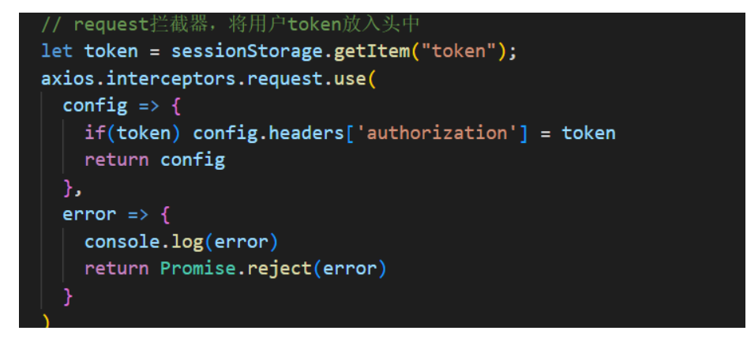

# 解决session共享问题

再集群session下，session的共享是一个问题，我们使用redis+token来解决。

之前使用session的流程是，用户输入账号和密码进行校验，服务器验证用户信息通过，就再服务端生成用户相关数据保存再session中，并且将sessionid发送客户端，并存在客户端的cookie中。客户端后续请求时（tomcat会自动）携带sessionid，服务器通过sessionid来确认用户的身份和会话的状态。当用户退出或session过期或销毁时，客服端的sessionid也随之失效。

但是当用户数量非常多的时候，服务器压力就会增大，需要使用集群式的tomcat，但是每个tomcat的存的session信息不一定完全一样，就会导致用户确认状态的问题，解决这样问题 一复制session信息，但是太冗余了。而且session拷贝数据时有延迟。

更好的解决办法是使用redis来解决session共享问题。

使用redis来存用户信息状态的凭证（token），再服务器验证用户信息通过后，创建一个token，并且加入到redis中，之后的请求需要客户端携带token（编码实现）



服务器根据验证token是否存在redis中来判断用户的状态。 

# 登录session最佳实践

## 登录流程

发送短信验证码：用户输入手机号---->校验手机号是否合法---->生成验证码---->sms服务

登录：输入验证码--->校验验证码---->登录成功-->将用户部分信息保存在session中。

登录校验：从发来的请求中---->接收session--->根据sessionid获取session中的用户信息--->校验用户是否为空-->验证成功。

## 实例代码1

controller

```java
@Slf4j
@RestController
@RequestMapping("/user")
public class UserController {

    @Resource
    private IUserService userService;


    /**
     * 发送手机验证码
     */
    @PostMapping("code")
    public Result sendCode(@RequestParam("phone") String phone, HttpSession session) {
        //  发送短信验证码并保存验证码

        return  userService.sendCode(phone,session);
    }

    /**
     * 登录功能
     * @param loginForm 登录参数，包含手机号、验证码；或者手机号、密码
     */
    @PostMapping("/login")
    public Result login(@RequestBody LoginFormDTO loginForm, HttpSession session){
        //  实现登录功能
        return userService.login(loginForm,session);
    }
    
    @GetMapping("/me")
    public Result me(){
        //获取当前登录的用户并返回
        return Result.ok(UserHolder.getUser());
    }
    
}
```

service

```java
public interface IUserService extends IService<User> {

    Result sendCode(String phone, HttpSession session);

    Result login(LoginFormDTO loginForm, HttpSession session);
}
```

Imp

```java
@Service
@Slf4j
public class UserServiceImpl extends ServiceImpl<UserMapper, User> implements IUserService {
      /**
     * 发送短信验证码
     * @param phone
     * @param session
     */
    @Override
    public Result sendCode(String phone, HttpSession session) {
        //判断手机号是否合法
        if(RegexUtils.isPhoneInvalid(phone)){
            //不合法， 就返回不符合
            return Result.fail("手机号不合法");
        }
        //合法  生成验证码
        String code = RandomUtil.randomNumbers(6);

        //保存到session中
        session.setAttribute("code",code);

        //发送验证码到手机   sms服务，先假装发送可以记录到日志中
        log.debug("发送验证码成功,验证码:{}",code);
        return Result.ok();
    }
    
    
    /**
     * 登录或注册用户
     * @param loginForm
     * @param session
     * @return
     */
    @Override
    public Result login(LoginFormDTO loginForm, HttpSession session) {
        //todo 校验手机号
        //校验验证码
        String cacheCode = session.getAttribute("code").toString();

        String code = loginForm.getCode();
        if (!code.equals(cacheCode)){
            //验证码不相同
            return Result.fail("验证码错误");
        }

        //根据手机号判断用户是否存在
        LambdaQueryWrapper<User> queryWrapper = new LambdaQueryWrapper<>();
        queryWrapper.eq(User::getPhone,loginForm.getPhone());
        User user = super.getOne(queryWrapper);
        if (user ==null){
            //用户不存在，注册用户，填上基本信息,保存
            User user1 = new User();
            user1.setPhone(loginForm.getPhone());
            user1.setNickName("user_"+RandomUtil.randomString(4));
            user = user1;
            //保存到数据库中
            super.save(user1);
        }
        //用户存在就保存在session
        session.setAttribute("user",user);
        
        return Result.ok() ;
    }
}
```

对于校验来说：不仅仅是登录流程会校验用户是否登录成功，其他很多模块，比如下单模块，点评模块，也会校验用户是否登录。

我们可以使用拦截器实现。

```java
//@Component  拦截器是非常轻量级的组件，只有再需要时才会被调用
public class LoginInterceptor implements HandlerInterceptor {


    @Override
    public boolean preHandle(HttpServletRequest request, HttpServletResponse response, Object handler) throws Exception {
        //1. 获取session
        HttpSession session = request.getSession();
        // 2. 获取session中的用户
        Object user = session.getAttribute("user");
        if (user == null) {
            //没有用户信息
            response.setStatus(401);
            return false;
    }
        //3. 保存到ThreadLocal中
       UserHolder.saveUser((User) user);
       return true;
    }

    @Override
    public void afterCompletion(HttpServletRequest request, HttpServletResponse response, Object handler, Exception ex) throws Exception {
       //移除信息，避免内存泄露
        UserHolder.removeUser();
    }
}
```

这里使用了ThreadLocal，是一种保证线程安全的线程。

```java
public class UserHolder {
    private static final ThreadLocal<User> tl = new ThreadLocal<>();

    public static void saveUser(User user){
        tl.set(user);
    }

    public static User getUser(){
        return tl.get();
    }

    public static void removeUser(){
        tl.remove();
    }
}
```

加入拦截器

```java
@Configuration
public class WebMvcConfig implements WebMvcConfigurer {


    @Override
    public void addInterceptors(InterceptorRegistry registry) {
        registry.addInterceptor(new LoginInterceptor())
                .excludePathPatterns(
                        "/user/code",
                        "/user/login",
                        "/shop-type/**",
                        "/shop/**",
                        "/blog/hot"
                );
    }
}
```


tips:需要注意的是，上述使用mybatis-Plus的查出的user,直接保存在了服务器的session中，不应该查出来一些不重要的字段比如更新时间，还有就是密码敏感信息，怎么办呢？可以使用select 需要的字段。或者就是重新定义ThreadLocal,重新定义泛型去除敏感信息。


这种session的实现方式，仅仅使用用单个环境下使用。在多集群方式下会有session共享问题。不过实现简单。

解决session共享问题，可以使用redis+token 方式实现。或者使用JWT,本片文章先说前者。


## 解决session共享问题

controller和service代码不变

Imp

```java
/**
 * @author ls
 */
@Service
@Slf4j
public class UserServiceImpl extends ServiceImpl<UserMapper, User> implements IUserService {

    @Autowired
    private  StringRedisTemplate redisTemplate;
    /**
     * 发送短信验证码
     * @param phone
     * @param session
     */
    @Override
    public Result sendCode(String phone, HttpSession session) {
        //判断手机号是否合法
        if(RegexUtils.isPhoneInvalid(phone)){
            //不合法， 就返回不符合
            return Result.fail("手机号不合法");
        }
        //合法  生成验证码
        String code = RandomUtil.randomNumbers(6);

        //保存到session中
        //session.setAttribute("code",code);

        //以手机号为k，手机验证码为v 保存在redis中
        redisTemplate.opsForValue().set(RedisConstants.LOGIN_CODE_KEY + phone,code,60, TimeUnit.SECONDS);

        //发送验证码到手机   sms服务，先假装发送可以记录到日志中
        log.debug("发送验证码成功,验证码:{}",code);
        return Result.ok();
    }

    /**
     * 登录或注册用户
     * @param loginForm
     * @param session
     * @return
     */
    @Override
    public Result login(LoginFormDTO loginForm, HttpSession session) {
        //校验验证码
//        String cacheCode = session.getAttribute("code").toString();
        String cacheCode = redisTemplate.opsForValue().get(RedisConstants.LOGIN_CODE_KEY + loginForm.getPhone());
        String code = loginForm.getCode();
        if (!code.equals(cacheCode)){
            //验证码不相同
            return Result.fail("验证码错误");
        }

        //根据手机号判断用户是否存在
        LambdaQueryWrapper<User> queryWrapper = new LambdaQueryWrapper<>();
        queryWrapper.eq(User::getPhone,loginForm.getPhone());
        User user = super.getOne(queryWrapper);
        if (user ==null){
            //用户不存在，注册用户，填上基本信息,保存
            User user1 = new User();
            user1.setPhone(loginForm.getPhone());
            user1.setNickName("user_"+RandomUtil.randomString(4));
            user = user1;
            //保存到数据库中
            super.save(user1);
        }
        //用户存在就保存在session
        //session.setAttribute("user",user);

        //用户信息保存在redis中  以随机token为k,用户信息为v
        String token = UUID.randomUUID().toString(true);
        //将对象转为hash类型
        Map<String, Object> usermap = BeanUtil.beanToMap(user,new HashMap<>(),
                CopyOptions.create()
                        .setIgnoreNullValue(true)
                        .setFieldValueEditor((fieldName,fieldValue) -> fieldValue.toString()));
        //存在redis中
        redisTemplate.opsForHash().putAll(RedisConstants.LOGIN_USER_KEY+token,usermap);
        //设置token有效期
        redisTemplate.expire(RedisConstants.LOGIN_USER_KEY +token,12,TimeUnit.HOURS);

        //返回token
        return Result.ok(token) ;
    }

}
```

拦截器

```java
public class LoginInterceptor implements HandlerInterceptor {


    private StringRedisTemplate stringRedisTemplate;

    public LoginInterceptor(StringRedisTemplate stringRedisTemplate) {
        this.stringRedisTemplate = stringRedisTemplate;
    }

    @Override
    public boolean preHandle(HttpServletRequest request, HttpServletResponse response, Object handler) throws Exception {
//        //1. 获取session
//        HttpSession session = request.getSession();
//        // 2. 获取session中的用户
//        Object user = session.getAttribute("user");
//        if (user == null) {
//            //没有用户信息
//            response.setStatus(401);
//            return false;
//        }
//        //3. 保存到ThreadLocal中
//        UserHolder.saveUser((User) user);
//
//        return true;

        // TODO 1. 获取token, 前端要明确指定发送token
        String token = request.getHeader("authorization");
        if (StrUtil.isBlank(token)) {
            //为空
            response.setStatus(401);
            return  false;
        }

        // TODO 2.基于token获取redis中的用户
        Map<Object, Object> objectMap = stringRedisTemplate.opsForHash().entries(RedisConstants.LOGIN_USER_KEY+token);
        //判断用户是否存在
        if (objectMap.isEmpty()){
            //不存在
            response.setStatus(401);
            return false;
        }
        //将map转对象
        User user = BeanUtil.fillBeanWithMap(objectMap, new User(), false);

        //保存再threadLocal
        UserHolder.saveUser(user);

        //刷新token有效期
        stringRedisTemplate.expire(RedisConstants.LOGIN_USER_KEY+token,RedisConstants.LOGIN_USER_TTL, TimeUnit.SECONDS);

        return true;

    }

    @Override
    public void afterCompletion(HttpServletRequest request, HttpServletResponse response, Object handler, Exception ex) throws Exception {
       //移除信息，避免内存泄露
        UserHolder.removeUser();
    }
}

```

注册拦截器

```java
@Configuration
public class WebMvcConfig implements WebMvcConfigurer {

    @Resource
    private StringRedisTemplate stringRedisTemplate;

    @Override
    public void addInterceptors(InterceptorRegistry registry) {
        registry.addInterceptor(new LoginInterceptor(stringRedisTemplate))
                .excludePathPatterns(
                        "/user/code",
                        "/user/login",
                        "shop-type/**",
                        "shop/**",
                        "blog/hot"
                );
    }
}
```


大量session存到redis中不是特别好的方案。更好的解决方案JWT。


# 双拦截器无感刷新token

分析：单个拦截器，只拦截需要用户登录才能访问的页面，假如用户登录之后，访问不需要拦截的页面，比如说主页，拦截器并不会执行，token也不会刷新。

解决：可以在引入一个拦截器，拦截所有的请求，该拦截器的主要目的就是刷新token,

第一个拦截器: 主要是刷新token,并将对应的用户信息保存在ThreadLocal,这样第二个拦截器直接可以从ThreadLocal获取值。

```java
/**
 * 刷新token拦截器，拦截所有
 *
 * */
public class RefleshTokenInterceptor implements HandlerInterceptor {


    private StringRedisTemplate stringRedisTemplate;

    public RefleshTokenInterceptor(StringRedisTemplate stringRedisTemplate) {
        this.stringRedisTemplate = stringRedisTemplate;
    }

    @Override
    public boolean preHandle(HttpServletRequest request, HttpServletResponse response, Object handler) throws Exception {

        //  1. 获取token
        String token = request.getHeader("authorization");
        if (StrUtil.isBlank(token)) {
            //为空 放行
//            response.setStatus(401);
            return  true;
        }

        // 2.基于token获取redis中的用户
        Map<Object, Object> objectMap = stringRedisTemplate.opsForHash().entries(RedisConstants.LOGIN_USER_KEY+token);
        //判断用户是否存在
        if (objectMap.isEmpty()){
            //不存在 放行
//            response.setStatus(401);
            return true;
        }
        //将map转对象
        User user = BeanUtil.fillBeanWithMap(objectMap, new User(), false);

        //保存再threadLocal
        UserHolder.saveUser(user);

        //刷新token有效期
        stringRedisTemplate.expire(RedisConstants.LOGIN_USER_KEY+token,RedisConstants.LOGIN_USER_TTL, TimeUnit.MINUTES);

        return true;

    }

    @Override
    public void afterCompletion(HttpServletRequest request, HttpServletResponse response, Object handler, Exception ex) throws Exception {
       //移除信息，避免内存泄露
        UserHolder.removeUser();
    }
}

```

第二个拦截器

```java
/**
 * 拦截器，拦截需要认证的业务
 */
public class LoginInterceptor implements HandlerInterceptor {


    @Override
    public boolean preHandle(HttpServletRequest request, HttpServletResponse response, Object handler) throws Exception {

        // todo: 单拦截器  session登录方式
//        //1. 获取session
//        HttpSession session = request.getSession();
//        // 2. 获取session中的用户
//        Object user = session.getAttribute("user");
//        if (user == null) {
//            //没有用户信息
//            response.setStatus(401);
//            return false;
//        }
//        //3. 保存到ThreadLocal中
//        UserHolder.saveUser((User) user);
//
//        return true;


        // todo: 但拦截器 token登录方式
//        // TODO 1. 获取token
//        String token = request.getHeader("authorization");
//        if (StrUtil.isBlank(token)) {
//            //为空
//            response.setStatus(401);
//            return  false;
//        }
//
//        // TODO 2.基于token获取redis中的用户
//        Map<Object, Object> objectMap = stringRedisTemplate.opsForHash().entries(RedisConstants.LOGIN_USER_KEY+token);
//        //判断用户是否存在
//        if (objectMap.isEmpty()){
//            //不存在
//            response.setStatus(401);
//            return false;
//        }
//        //将map转对象
//        User user = BeanUtil.fillBeanWithMap(objectMap, new User(), false);
//
//        //保存再threadLocal
//        UserHolder.saveUser(user);
//
//        //刷新token有效期
//        stringRedisTemplate.expire(RedisConstants.LOGIN_USER_KEY+token,RedisConstants.LOGIN_USER_TTL, TimeUnit.MINUTES);

        // todo 修改拦截器为双拦截器后的代码，直接根据全拦截器看ThreadLocal的值判断是否拦截
        User user = UserHolder.getUser();
        if (user == null) {
            //没有用户信息 需要拦截
            response.setStatus(401);
            return  false;
        }
        return true;

    }

    @Override
    public void afterCompletion(HttpServletRequest request, HttpServletResponse response, Object handler, Exception ex) throws Exception {
       //移除信息，避免内存泄露
        UserHolder.removeUser();
    }
}
```

拦截器注册: 需要注意的是拦截器执行的先后，可以设置order属性默认是0，数字越小优先级越高。

```java
@Configuration
public class WebMvcConfig implements WebMvcConfigurer {

    @Resource
    private StringRedisTemplate stringRedisTemplate;


    //登录拦截器
    @Override
    public void addInterceptors(InterceptorRegistry registry) {
        registry.addInterceptor(new LoginInterceptor())
                .excludePathPatterns(
                        "/user/code",
                        "/user/login",
                        "/shop-type/**",
                        "/api/shop/**",
                        "/blog/hot"
                ).order(1);

        //刷新token拦截器
        registry.addInterceptor(new RefleshTokenInterceptor(stringRedisTemplate))
                .addPathPatterns("/**")
                .order(0);
    }
}
```

